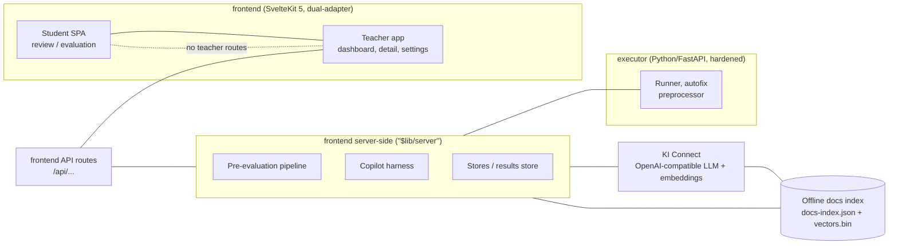
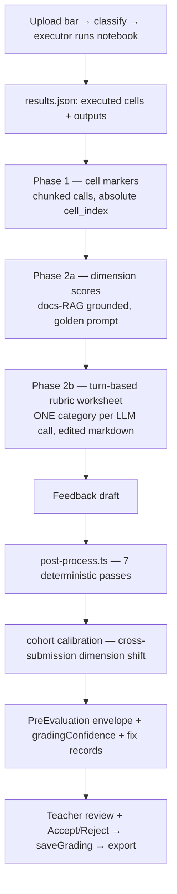

# Architecture

**SciPro Review** — a teacher/student notebook-grading suite. This is the
canonical, current architecture reference. It is deliberately one document:
component map, data flow, and module map, kept in sync with the code. The
[data structures](data-structures.md) and [developer guide](developer-guide.md)
sit alongside; the [quality statement](quality-statement.md) is the honest
accuracy baseline, and [assignment-calibration](assignment-calibration.md) is
how to onboard a new assignment. **New maintainers:** start with
[Concepts & trust boundaries](concepts.md) (the explainable mental model +
visuals), then return here for the module-level detail. Historical decisions
are logged under [decisions/](decisions/).

> **Keep this honest.** If you change the pipeline's phases, add a server
> module, or move a data structure, update this file in the same change. A doc
> that names a file or module that no longer exists is worse than no doc.

---

## 1. System overview

A **monorepo** with two applications plus runtime configuration:

| Component | What it is |
| --- | --- |
| `frontend/` | SvelteKit 5 app (runes), Tailwind CSS v4, pnpm. Ships **two builds** via the `ADAPTER` env var: **student** (`adapter-static`, GitHub Pages SPA) and **teacher** (`adapter-node`, Node/Docker server). |
| `executor/` | Python **notebook-execution** backend (FastAPI, uv). Runs untrusted student notebooks in a hardened container. |
| `data/` | Tracked config (`assignments.yaml`, `grading_config.yaml`, `settings.yaml`, `criteria/*.yaml`, `scoring/*.yaml`, `cohort_norms/*.yaml`) + gitignored runtime state (`submissions/`, `plagiarism/`, `copilot/`, `materials/`). |
| `.github/references/` | Tracked docs home (calibration, quality statement, tokens, **this file**). |
| `.github/references/directives/` | Tracked, **non-negotiable** pipeline contracts (e.g. `turn-based-preeval.md`). |

**The core idea (per the VISION):** the AI is a **copilot that works *with*
the teacher** — it pre-evaluates, drafts a rubric worksheet and feedback, and
proposes changes the teacher reviews and accepts. It is *not* an autonomous
grader.



---

## 2. Component map

### 2.1 Frontend — student vs teacher

The same codebase renders two experiences gated by the `ADAPTER` build flag
(`__TEACHER_MODE__` in code). Teacher routes (dashboard, per-submission review,
settings, copilot, plagiarism) compile only in `ADAPTER=node`; the student
build is the pre-rendered SPA with `review/` + `review/[id]/evaluation`.

Relevant route trees:

```
routes/
  +page.svelte                  landing (mode-aware)
  docs/                         in-app teacher documentation
  review/[id]/evaluation/       STUDENT: read-only evaluation view
  submissions/                  TEACHER: dashboard (list, upload, process/pre-eval)
  submissions/[id]/             TEACHER: per-submission review (cells, rubric, grading, copilot)
  settings/                     TEACHER: settings, assignments (criteria/scoring editors)
  api/                          all server endpoints (see §5)
```

### 2.2 Frontend — client-side state (`frontend/src/lib`)

| Area | Files | Role |
| --- | --- | --- |
| **Types** | `types/` (`submissions.ts`, `criteria.ts`, `grading.ts`, `assignments.ts`, `evaluation.ts`, `settings.ts`, `session.ts`, `persistence.ts`, `index.ts`) | Client-safe wire types. Interface changes ripple here — grep producers when editing. |
| **API client** | `services/submissions-api.ts` | Typed `fetch` wrapper for every `/api/*` endpoint (single source of URL/JSON contract). |
| **Data stores** | `services/submissions-store.svelte.ts`, `plagiarism-store.svelte.ts`, `run-state.svelte.ts`, `autofix-store.svelte.ts`, `grade-calculator.ts`, `grading-config.ts`, `criteria-loader.ts` | Rune-based singletons + pure helpers. |
| **Legacy student stores** | `stores/{review,grading,selection,session,rubric,export,header,settings,toast}.svelte.ts` | The student-side grading implementation (`ReviewStore` orchestrator) + app-wide UI state. |
| **Utils** | `utils/apply-suggestion.ts`, `submission-filters.ts` (service) | Pure helpers shared by routes/components. |
| **UI components** | `lib/components/` | Hand-rolled, dependency-free, **token-only** components (`var(--…)`). |
| **Server-side libs** | `lib/server/` | See §3 / §4. Runs only in teacher mode (SSR) or API routes. |

### 2.3 Server-side layering (`lib/server`)

```
lib/server/
  ki-connect.ts            OpenAI-compatible endpoint abstraction (any harness can use it)
  metadata.ts              submission record I/O + id resolution (studentId, relativePath)
  results-store.ts         per-assignment results.json read/write (PreEvaluation envelopes)
  executor-client.ts       HTTP client → executor (run notebooks)
  file-service.ts          classify/validate uploads; STUDENT_FILENAME_RE, data-extension set
  criteria.ts              load/merge rubric criteria YAML
  settings.ts              settings.yaml (read fresh every request)
  grading-config-writer.ts / grading-validation.ts   global grading_config editor
  assignments.ts / assignments-writer.ts   assignment registry + editor
  backup-service.ts        data-dir backup ZIP
  plagiarism/              cache.ts, structural.ts, semantic.ts — plagiarism engine
  pre-eval-logs.ts / pre-eval-progress.ts / process-progress.ts / batch-progress.ts
  copilot/                 the pre-evaluation pipeline + copilot harness (see §3)
```

---

## 3. The pre-evaluation pipeline

Pre-evaluation is the deterministic-then-LLM layer that turns an executed
notebook into a full draft grade worksheet. The non-negotiable contract is
[`directives/turn-based-preeval.md`](directives/turn-based-preeval.md) —
read it before touching this code.

### 3.1 Codes of the pipeline

```
pre-evaluation.ts          orchestrator (assembles envelope, score caps, confidence, calibration)
pipeline/phases.ts         Phase execution: Phase 1 markers + turn-based Phase 2b rubric
pipeline/context.ts        prompt context builders (preview bounds, pre-analysis formatting)
pipeline/prompts.ts        system/user prompt templates (Phase 1, Phase 2a, turn-based)
pipeline/validate.ts       zod + semantic validation of LLM JSON
pre-analysis.ts            DETERMINISTIC detectors (imports, kwarg-assign, non-descriptive names, …)
scoring-config.ts          per-assignment scoring config (anchors, evidence, disallowed libs, guidance)
worksheet.ts               turn-based worksheet: generate, validate sections (exact-text), mutual-exclusion
worksheet-json-schema.ts   JSON schema for worksheet parsing
post-process.ts            7 deterministic correction passes (see below)
cohort-calibration.ts      cross-submission dimension recalibration (reference anchors)
legacy-export.ts           buildLegacyId / generateLegacyGradeJson — legacy-format export keys
docs-rag.ts                hybrid BM25 + embeddings retrieval over the offline docs index
screening.ts               screen student cell content before it enters any prompt (B13)
over-tick.ts               over-tick guard (Signal A/B/C advisory flags)
rubric-fidelity.ts         runEvals judge (P12)
agent.ts / registry.ts / tools/   the interactive copilot harness (see §4)
```

### 3.2 Pipeline flow



**Key contracts**

- **Phase 1** markers classify each cell (marker label + reason). Notebooks over
  `CHUNK_SIZE` (20) cells are processed in sequential chunks and re-indexed to
  absolute positions (`toAbsoluteMarker`).
- **Phase 2a** produces the dimension scores (points, e.g. `0..max_points`).
  Its prompt is **byte-exact** against
  `tests/copilot/fixtures/phase2a-prompt-golden.txt` — never change it
  silently. It carries a `{DOCS_FACTS}` block grounded through `searchDocs`
  over the API usage found in the notebook.
- **Phase 2b** (turn-based) edits **one rubric category section per LLM call**:
  the model returns the edited markdown section (not JSON), which is validated
  against the worksheet (exact option text, mutual-exclusion pairs) and
  re-spliced. A failure loops up to `MAX_RETRIES` (3); **the retry loop IS the
  verification** — there is no separate verify/critique pass. No N/A escape
  hatch.
- **Post-process** runs **7 deterministic passes** (last = evidence-grounded),
  each recording a `PostProcessFix` in the audit trail:
  1. fill-empty (mandatory categories get a checkbox or textarea)
  2. checkbox-textarea-sync
  3. disallowed-library-scan (allow-list resolved per-assignment from the
     scoring config)
  4. strip-plagiarism (plagiarism language out of textareas)
  5. strip-filler (universally-true filler out)
  6. fill-textarea (short textareas get evidence-cited notes;
     `TEXTAREA_MIN_CHARS`=20)
  7. evidence-grounded (selections contradicting deterministic pre-analysis
     are corrected)
- **Cohort calibration** re-centers dimension scores against the cohort's
  reference anchors; the old→new pairs are stored as `calibrationAdjustments`
  and surfaced in the UI. Runs only when the assignment has `reference_anchors`
  in its scoring config.

### 3.3 Screening (trust boundary)

Student notebook text is **untrusted input**. Before any of the above prompts
are built, `screening.ts` runs a small/fast LLM over the cell content
(`SCREENING_MODEL`, default `qwen3-30b-a3b`) to detect instruction-smuggling.
On "injection" the cell source is stripped from the prompt and
`gradingConfidence` is forced to `needs_review`. Screening **fails open** — a
guard failure must never break grading (same rule as the copilot detectors).

---

## 4. The copilot harness

The teacher-facing AI assistant drives the webapp **through tools**, exactly
like the teacher does in the UI. It is a Mastra agent whose turns are phase-
grouped in the transcript and whose grading writes go through the **same save
path** as the teacher's own Save button.

```mermaid
flowchart LR
    U[Teacher prompt] --> AG[agent.ts<br/>guardrails: injection 0.7 + PII]
    AG --> REG[registry.ts<br/>permission: auto / approval]
    REG --> T{Which tool family?}
    T --> AN[analysis-tools: analyze code]
    T --> CO[context-tools: get submission context<br/>(screens cell content)]
    T --> DO[docs-tools: search-docs (RAG-grounded)]
    T --> GR[grading-tools: set rubric / dimension score / notes / save]
    T --> PR[preeval-tools / ref-tools / ops / management]
    AN --> TL[tool result → phase-grouped transcript]
    GR --> CH[change ledger: accept/reject + turn checkpoints]
```

- **Tool registry** (`registry.ts`) enforces unique names + Zod input
  validation on every call; `permission: "approval"` tools surface an approval
  card the teacher can steer.
- **Tool-result summaries** are hard-capped and URL-guarded before re-entering
  the model (they can carry student content).
- **Checkpoints** (`checkpoint-store.ts`) snapshot grading state per turn so the
  teacher can **revert a whole turn**.
- **Dimension scores** written by tools must be **points on `[0, max_points]`**
  (resolved at run time from `grading_config.yaml`) — the old `[0,1000]`
  slider-scale bound was a bug (B7); a value like `800` is rejected with a
  typed argument error.
- **Grading state** (rubric selections, dimension scores, feedback, notes)
  persists through the same `saveGrading` path the teacher uses, so a copilot
  edit and a teacher edit are indistinguishable downstream.

---

## 5. API surface (teacher mode)

| Endpoint | Purpose |
| --- | --- |
| `POST /api/submissions/upload` | Multipart upload (any number of files), classify, persist per-file results |
| `POST /api/submissions/process` | Batch-process notebooks via the executor |
| `POST /api/submissions/pre-evaluate` | Run the pre-evaluation pipeline for the batch; `GET …/status` polls progress |
| `GET /api/submissions` · `GET /api/submissions/[id]` | List + detail (cells, preEval, over-tick, calibration) |
| `POST/DELETE …/[id]/grade`, `reset`, `export`, `archive` | Per-submission grading lifecycle |
| `GET /api/pipeline/status` | Unified process + pre-eval run status (reload-mid-run restore) |
| `GET /api/plagiarism/results` · `POST /api/plagiarism/check` · `PATCH …/status` | Plagiarism engine |
| `POST /api/copilot/chat` · `POST /api/copilot/approval` · `…/threads` | Copilot harness turn + approvals + threads |
| `POST /api/assignments/[id]/scoring/draft` · `POST /api/assignments/[id]/criteria/draft` | LLM **drafts** YAML, never writes; save goes through the compile gate |
| `GET/PUT /api/config/grading` · `…/criteria` · `/api/settings` · `/api/backup` | Grading config, criteria, settings, backup |

---

## 6. The executor (untrusted code)

`executor/` is a FastAPI service that runs student notebooks in a **hardened
container** (`cap_drop: [ALL]`, `no-new-privileges`, read-only rootfs with a
`tmpfs` `/tmp`, pids cap). The frontend never executes student code itself.

```
executor/
  app.py            FastAPI routes (health, execute, autofix)
  runner.py         notebook execution; extracts outputs incl. rich image/html (B11)
  preprocessor.py   marker annotations / pre-process
  auto_fix.py       strip_legacy_autofix_comments + autofix passes
  ki_connect.py     (executor-side KI Connect helpers)
  logs.py           streaming execution logs
```

Two env caps govern **rich outputs** (B11): `RICH_OUTPUT_MAX_IMAGE_BYTES`
(5 MiB default) and `RICH_OUTPUT_MAX_HTML_CHARS` (200 k). Rich output is never
included in LLM prompts (they stay text-only) and student HTML renders in a
**sandboxed iframe** (`sandbox=""`) client-side.

---

## 7. Offline docs index (grounding)

`scripts/build-docs-index.mjs` builds the hybrid retrieval index into
`<DATA_DIR>/docs-index/` (`docs-index.json` + `docs-vectors.bin`, float32 LE,
row-major). 19,109 chunks across numpy/pandas/scipy/sklearn/matplotlib (4096
dims; matplotlib from a crawled `api/` tree). `docs-rag.ts` loads it lazily and
**never throws** — a missing/broken index degrades to BM25-only retrieval with a
`loadNote`. `search-docs` verifies API facts before the copilot flags student
code as wrong.
