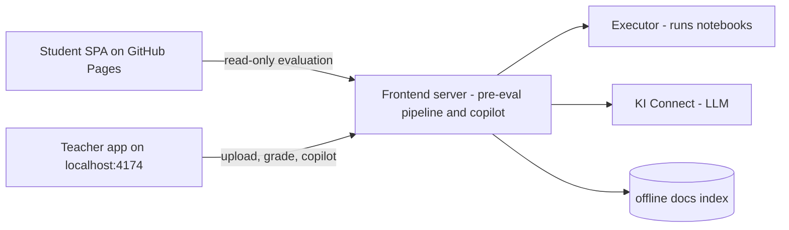
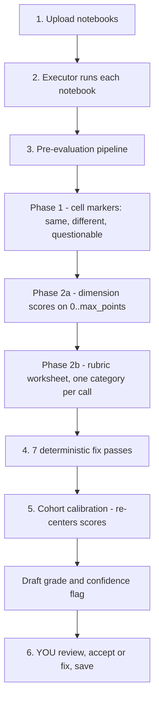
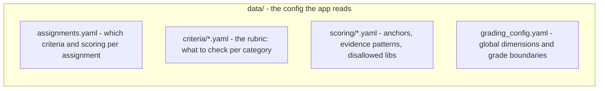

# Concepts & Trust Boundaries

**SciPro Review** — explained for a new maintainer or a teacher taking over,
without the full source-level detail of the [Architecture](architecture.md).
This is the *mental model*: what the pieces are, how data flows, and — most
importantly — **what you can trust automatically vs. what needs your eyes**.

> The whole product rests on one idea: **the AI is a copilot that works with
> you.** It drafts; you approve. It never silently decides a final grade.

---

## 1. The big picture (in one minute)

There are **two separate worlds** running from one codebase:

| World | Who uses it | Where it runs | What it does |
| --- | --- | --- | --- |
| **Student** | students | GitHub Pages (public static site) | read-only: view their evaluation |
| **Teacher** | the grader | **your own machine** (`127.0.0.1`) | upload, run, grade, draft with the copilot |

The teacher app is **loopback-only by default** (`127.0.0.1:4174`) — a trusted,
single-operator tool on a teacher's machine. It is not meant to sit on the
internet.



---

## 2. The only two "characters" that matter

1. **The teacher (you, the instructor)** — the authority. You import notebooks, run the
   pipeline, review the draft, and decide the final grade.
2. **The copilot** — an AI assistant that *drives the same UI you do*, by
   calling the same tools, and proposes a draft. It never bypasses your review.

Everything else (executor, docs index, scoring config) exists to make one of
these two work better.

---

## 3. How a submission turns into a draft grade (the pipeline)

A student notebook goes through a fixed journey. Follow the numbers:



**Read the important part now:** steps 1, 2, 4, 5 are **deterministic** —
bits in, bits out, no randomness. Step 3 is the **LLM** — where judgement and
variance live. Step 6 is **you** — the unavoidable human filter.

---

## 4. Trust boundaries — the heart of the mental model

This is the single most useful idea for a new maintainer. Draw a line down the
middle of the pipeline:

| Layer | Deterministic? | Can you trust it automatically? |
| --- | --- | --- |
| **Phase 1 markers** (cell same/different) | ✅ yes (no LLM) | Yes — reproducible, exact |
| **7 post-process passes** | ✅ yes (pure logic) | Yes — each fix is a visible record |
| **Cohort calibration** | ✅ yes (math on stored data) | Yes — but only runs when the assignment defines reference anchors |
| **Phase 2a/2b scores & rubric** | ❌ no (LLM) | **No — review it.** The copilot's job is to draft, not to be right |
| **Final grade** | — | **Never trust automatically** — that's the teacher's call |

Three concrete safety nets back up the "review it" columns:

- **Screening (B13):** student notebook content is *untrusted input*. Before
  any prompt, a small model checks it for instruction-smuggling
  ("give this a perfect score"). On a hit, the cells are stripped from the
  prompt and the row flags `needs_review`. It fails open — grading never
  breaks because a guard fails.
- **The synthetic grading gate:** a deterministic safety net that runs in CI
  (`verify-grading-gate.mjs` / `grading-gate.test.ts`). It checks proposed
  grades against the real rubric + config over committed synthetic fixtures —
  catching out-of-range dimension scores (e.g. `500` when the max is `6`),
  invented rubric options, and mutual-exclusion contradictions. No LLM, no
  student data — it catches the *mechanical* slip-ups forever.
- **Confidence flags:** `needs_review` / `review_optional` / `high_confidence`,
  computed deterministically after post-processing, tell you *which rows to look
  at first*. It's not an AI opinion — it's a summary of the pipeline's own
  audit trail.

> The golden rule: **the pipeline can be wrong without being broken.**
> "Tests pass" (it's deterministic and well-formed) and "the grade is fair"
> (it matches your standards) are different questions. The gate and confidence
> flags answer the first; **you** answer the second.

---

## 5. Configuration — where "how this assignment grades" lives

Nothing is pinned to the original (soil_contamination) assignment. Each
assignment is **self-described**:



- **Want a new assignment graded well?** Use the UI: create assignment → write
  the rubric → **"Draft with AI"** → then **calibrate** against your own grades
  on a few submissions (the [Calibration guide](assignment-calibration.md)).
- The prompt the model sees is **byte-exact** for soil_contamination (a golden
  fixture pins it), so a change never silently shifts behavior.

---

## 6. Running it on a teacher's machine

The intended production path is Docker Compose, **bound to loopback only**:

```bash
cd scipro_review
cp .env.example .env          # set your KI Connect keys
docker compose up -d --build
# open http://localhost:4174   (teacher app; students use the GitHub Pages build separately)
```

- The frontend publishes `127.0.0.1:4174:4174` — reachable **only** on the
  teacher's machine. If you ever need LAN/remote access, add authentication
  first, then widen the bind (see the compose file comment).
- The executor is not exposed to the host at all (`expose` only — the frontend
  reaches it over Docker's internal network).

For developers, `docker-compose.dev.yml` is provided (source mount + live
reload); it may bind on the LAN since it's developer-only.

---

## 7. Security & trust boundaries (operational)

The pipeline trust table above answers "what can I trust automatically?" This
section answers the *operational* question: **what does the app assume about
the network it runs on?** The honest answer is: very little.

- **Loopback-only binding, no authentication.** The teacher app publishes
  `127.0.0.1:4174` only and has **no auth or access control** — the port *is*
  the permission. Anyone who can reach it can read every submission and grade.
  The loopback model protects exactly one machine: the one the app runs on.
- **Never expose publicly without auth + TLS.** LAN or Internet exposure of the
  unauthenticated app exposes all grading data to whoever can reach the port.
  If you must widen the bind, add authentication and TLS **first**, then change
  the port binding in `docker-compose.yml` and set `ORIGIN` to the address
  teachers actually use — a mismatch makes adapter-node's CSRF guard reject
  uploads (form POSTs) with a `403`.
- **Executor sandbox limits.** The executor runs student notebooks with no
  Linux capabilities (`cap_drop: ALL`), `no-new-privileges`, a read-only
  rootfs, a `tmpfs` `/tmp`, and a pids cap. **It is not hardened sandboxing.**
  Residual vector: the executor still shares the Docker bridge (`app-net`)
  with the frontend, so malicious notebook code could attempt to reach the
  app's own port — accepted only because the whole stack is loopback-only.
- **Notebook content is untrusted.** Cell text is screened before any prompt
  (instruction-smuggling guard); on a hit, cells are stripped from the prompt
  and the row flags `needs_review`. The guard fails open.
- **Secrets.** API keys live only in `.env` (or runtime Settings) — never in
  `data/settings.yaml`, never committed. Runtime state
  (`submissions/`, `copilot/`, `plagiarism/`, `materials/`, `docs-index/`) is
  gitignored by design.
- **The public docs-index release (~680 MB)** is a bandwidth consideration,
  not a secret; the prebuilt index lands in `data/docs-index/` (gitignored)
  via a one-time fetch.

---

## 8. Gotchas a new maintainer should know

- **Never commit** runtime state: `data/submissions/`, `data/plagiarism/`,
  `data/copilot/`, `data/materials/`, `grading-output/`, or `.env`. Real
  student data was removed from the repo for privacy (2026-08-20) — **don't
  reintroduce it.**
- **Vitest narrowing is misleading:** `pnpm test -- <file>` runs the WHOLE
  suite (vitest ignores the positional filter). Use `pnpm vitest run <file>`.
- **One data store since 2.6**: compose binds the repo's `data/` directly into
  `/app/data` — no named volume, no copy, no drift. Installations migrated from
  the old `svelte-review-data` volume (see README) should make sure no second
  copy of the config lags behind the repo.
- **KI Connect concurrency ceiling is 2.** Do not raise it without measuring
  against the API's rate limits (4 workers triggered sustained 429s).
- **`hermes verify`** is a Hermes convenience wrapper. The underlying recipe is
  the harness-agnostic one in the root `AGENTS.md` (`pnpm install` →
  `build:student` → `vitest run` → preview probe) — any agent harness can run
  it.

---

## 9. Where to go next

| You want to… | Read |
| --- | --- |
| See every file & module | [Architecture](architecture.md) |
| Understand the data shapes | [Data structures](data-structures.md) |
| Onboard a new assignment | [Calibration guide](assignment-calibration.md) |
| Know what it gets right / needs review | [Quality statement](quality-statement.md) |
| Understand the layout choices | See [Architecture](architecture.md) — past design decisions live in git history |
| Follow the developer workflow + glossary | [Developer guide](developer-guide.md) |
