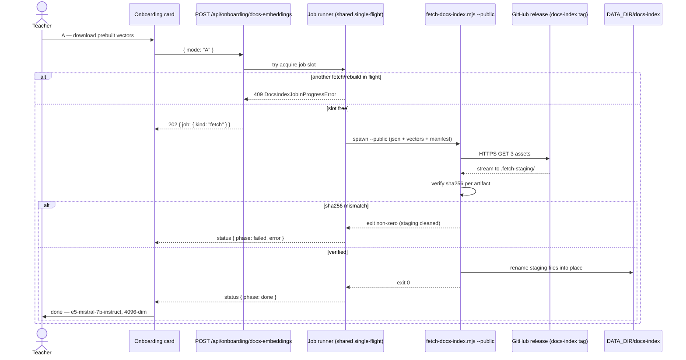
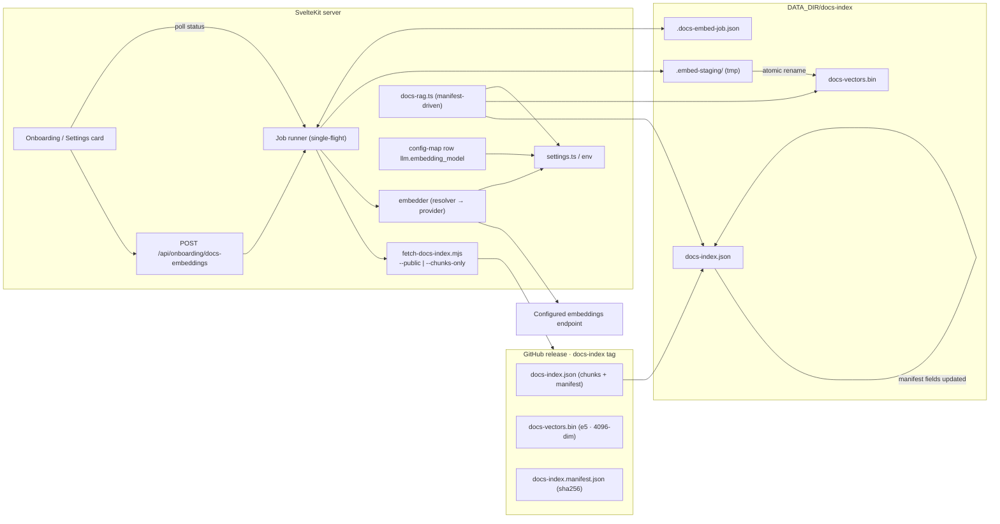

# 2.7.0 — Three-Option Docs-Embeddings Onboarding (Design + Scope)

| | |
|---|---|
| Version | 2.7.0 (minor, feature — semver per `.github/references/versioning.md`) |
| Status | Draft — for grouped sign-off (backend / frontend / docs-release) |
| Date | 2026-08-30 |
| Scope | Docs-embeddings onboarding choice A/B/C, manifest-driven query embedder, `llm.embedding_model` setting, e5-prefix toggle |
| Explicitly excluded | 2.6.1 (already cut at `09e8e33`), corpus re-chunking, new libraries, auto-rebuild, dim pad/trim |
| Deliverable shape | Design + scope only — this document authorizes the implementation waves in §8; nothing here is implemented by this doc |

Related code (all paths under `frontend/` unless noted):

- `scripts/fetch-docs-index.mjs` — release download (public/gh), sha256 verify, staging + rename
- `scripts/build-docs-index.mjs` — **off-limits corpus build** (Python venv + crawls), `EMBED_BATCH = 16`, `EMBED_CONCURRENCY = 2`
- `scripts/publish-docs-index.mjs` — maintainer-only release publication (`docs-index` tag)
- `src/lib/server/onboarding-docs-index.ts` — single-flight guard for the download path
- `src/routes/api/onboarding/docs-index/+server.ts` — `POST` (200 / 409 / 500)
- `src/lib/server/copilot/docs-rag.ts` — hybrid BM25 + embedding retrieval; `EMBEDDING_MODEL` hardcoded at `:143`, `defaultEmbedQuery()` at `:292`, dim guard at `:440`
- `src/lib/server/settings.ts` — `parseSettings` / `defaults()` / env fallbacks; `llm` section
- `src/routes/api/settings/+server.ts` — strict `isAppSettings` PUT guard
- `src/lib/server/config-map.ts` — live config inventory (row contract)
- `src/lib/server/batch-progress.ts` — in-memory progress-store pattern (`begin/update/end/get`)
- `src/routes/onboarding/+page.svelte` — checklist card with the current `docsDownload` state machine (`:78`, `startDocsDownload` `:205`)
- `src/routes/settings/+page.svelte` — config map + LLM setup surface
- `src/routes/api/settings/models/+server.ts` — live model registry listing

---

## 1. Motivation

The docs-RAG semantic leg is the last provider coupling in SciPro Review. The
BM25 leg is fully offline and provider-neutral; the vector leg is not — it is
hardwired to `e5-mistral-7b-instruct` at 4096 dims, both for the prebuilt
corpus (`docs-vectors.bin`) and for query embedding (`docs-rag.ts:143`), which
silently ties every deploy to a single embeddings vendor. 2.7.0 makes the
semantic leg optional-by-choice and model-agnostic: the teacher picks at
onboarding between **A** download the prebuilt vectors, **B** build vectors
locally from the released chunk set against *their* configured endpoint and
model, or **C** skip the vector leg entirely and run BM25-only. The supporting
contract change — the query embedder reads the embedding model from the index
manifest instead of a constant — is what makes any of B's outputs usable at
runtime, and makes the loader degrade safely (BM25-only, honest load note)
whenever the manifest and the live provider disagree. e5-dependence was the
last coupling; after 2.7.0 the only remaining assumption is *an*
OpenAI-compatible embeddings endpoint at build/query time.

## 2. Architecture — the three options

All three options converge on the same two-file index shape that the loader
already understands; they differ only in *where* `docs-vectors.bin` comes from.

Current index facts (unchanged by 2.7.0):

- `docs-index.json` — model-INDEPENDENT chunk texts + manifest (`formatVersion 1`; already carries `embeddingModel`, `embeddingDim`, `vectorsFile`, `vectorCount`, per-library manifest)
- `docs-vectors.bin` — float32 LE, row-major; chunk *i* at byte offset `i * embeddingDim * 4` (38,380 chunks × 4096 dims → ≈ 629 MB; the loader validates byte length against `chunks.length × dim × 4`, so any dim/count is fine as long as manifest and bin agree)
- `docs-index.manifest.json` — release integrity manifest (`sha256` per artifact); local copy kept alongside the index

### 2.1 Option A — download the prebuilt vectors (existing path)

The current onboarding path, unchanged in behavior: fetch the released
`docs-index.json` + `docs-vectors.bin` (e5-mistral-7b-instruct, 4096 dims)
over plain HTTPS with sha256 verification against the release manifest. No API
key needed. This stays the zero-effort default for teachers who do not care
about the embedding provider.



### 2.2 Option B — build vectors locally from the released chunks (new)

The new path. B reuses the **released chunk file** verbatim (corpus-build-free,
see §2.4) and regenerates only `docs-vectors.bin` by running the chunk texts
through the teacher's configured embeddings endpoint (base URL + key +
model from settings/env), with live progress, staged write-on-complete, and
the same single-flight guard family as the download path. The chunks are
fetched once via a new corpus-only mode of `fetch-docs-index.mjs`
(`--chunks-only`: downloads `docs-index.json` + `docs-index.manifest.json`,
skips the ≈ 629 MB bin) — or, if `docs-index.json` already exists locally,
the fetch phase is skipped entirely and B embeds straight from the local chunk
file.

```mermaid
sequenceDiagram
    actor Teacher
    participant UI as Onboarding card
    participant API as POST /api/onboarding/docs-embeddings
    participant Runner as Job runner (embed)
    participant Provider as Configured embeddings endpoint
    participant FS as DATA_DIR/docs-index

    Teacher->>UI: B — build vectors locally
    UI->>API: { mode: "B", model?, prefix?, overwrite? }
    API->>Runner: try acquire job slot (shared with fetch)
    alt no API key configured
        API-->>UI: 422 { error: "no API key" }
    else another job in flight
        Runner-->>API: 409
    else slot free
        API-->>UI: 202 { job: { kind: "embed", phase: "fetch-chunks" } }
        alt docs-index.json missing locally
            Runner->>FS: corpus-only fetch (--chunks-only, sha256 check)
        end
        Runner->>FS: read chunk list → total = 38,380 → plan batches (≤64, concurrency 2)
        loop each batch
            Runner->>Provider: POST /embeddings { model, input: [...] }
            Provider-->>Runner: vectors[batch][dim]
            alt wrong dim / provider error
                Runner->>Runner: retry w/ backoff (429 courtesy); fail + count on exhaustion
            end
            Runner->>FS: write vectors at offset i*dim*4 (staged .embed-staging/)
            Runner-->>UI: status { phase: embed, done, total, ratePerSecond, etaSeconds }
        end
        Runner->>FS: fsync staged bin → rename over docs-vectors.bin (atomic)
        Runner->>FS: manifest update: embeddingModel/dim/vectorCount/builtAt/embeddingPrefix
        Runner-->>UI: status { phase: done, model, dim, failedBatches }
        UI->>Teacher: done — "your model, N dims"
    end
```

**Cancellability:** `DELETE /api/onboarding/docs-embeddings` sets a cancel flag
the worker checks at batch boundaries. On cancel the staged bin, staging dir
and the persisted job-state file are removed; the existing `docs-index.json`
and `docs-vectors.bin` are untouched (they are only ever *replaced* by the two
final renames). A cancelled or failed B job therefore never degrades an
existing install retroactively.

### 2.3 Option C — skip the vector leg (BM25-only)

Explicit, honest opt-out. C records the teacher's decision in the UI state
(and, once the docs-index item is marked done, in `docs-index.json` absence or
a persisted marker) and shows the degradation note; no job runs, no API key is
needed for the docs leg.

```mermaid
sequenceDiagram
    actor Teacher
    participant UI as Onboarding card

    Teacher->>UI: C — skip vectors (BM25-only)
    UI->>UI: show honest note: exact API names (curve_fit, np.polyfit) still found by BM25;<br/>paraphrase queries ("fit a curve to data") weaken; no API key needed for docs
    Teacher->>UI: confirm skip
    UI->>Teacher: done — semantic leg disabled; "change mind" returns to A/B
```

### 2.4 The load-bearing decision: the chunk-vs-vector file split makes B corpus-build-free

The released index is already split into a **model-independent chunk file**
(`docs-index.json`) and a **model-dependent vector file** (`docs-vectors.bin`).
That split is the whole trick: B never re-derives chunks; it consumes the
shipped chunk texts byte-for-byte (sha256-verified) and regenerates only the
vector file. Nothing in B touches Python, venvs, crawls, or extraction.

The Python corpus-build path (`build-docs-index.mjs` + `extract-docstrings.py`)
stays **off-limits from the app** for five reasons:

1. **Environment.** The corpus build needs a venv with numpy/pandas/scipy/
   sklearn/matplotlib/seaborn *installed at the corpus versions* plus
   `MPLBACKEND=Agg` and a KI key. Shipping that into the SvelteKit container
   balloons the image, and any version drift silently invalidates the chunk
   ↔ package mapping (chunks are version-pinned per library in the manifest).
2. **Sources.** matplotlib and seaborn chunks come from *pre-crawled* HTML
   (the `--fetch-crawls` path returned 0 pages in CI and was replaced by a
   local crawl). Crawling is a maintenance-time operation, not something a
   runtime container can reproduce deterministically.
3. **Cost/time.** A full corpus build is a 30–60 min one-shot deploy op,
   deliberately gated behind the maintainer's `publish-docs-index.mjs` (the
   release workflow never auto-embeds). Turning that into a teacher-facing
   runtime op with no rollback would be a regression, not a feature.
4. **Coverage risk.** Both index migrations proved how easy it is to silently
   drop whole subpackages (allow-list gap; auto-descent fix `a0d15de`).
   Re-chunking from inside the app would re-introduce that class of corpus
   drift without a release gate.
5. **What B actually needs is smaller.** Re-embedding the *existing* 38,380
   chunks is, at worst, ~2,400 embedding API calls at concurrency 2 — a
   10–30 min job — with none of the above packaging risk.

### 2.5 B pipeline detail

| Aspect | Design |
|---|---|
| Chunk source | `fetch-docs-index.mjs --chunks-only` (new flag: download `docs-index.json` + manifest only) or the local copy; sha256 check against the release manifest when fetched |
| Input | `chunks[].text` verbatim — corpus texts are never re-chunked or trimmed (out of scope) |
| Batch size | `≤ 64` texts per request; **default 16** (the proven `EMBED_BATCH` constant from the build script), overridable per job, capped at 64. Providers with lower limits get 400s → job surfaces the provider's message |
| Concurrency | **2** (hard ceiling — the empirically safe KI Connect rate limit, 2026-08-17; `AGENTS.md` invariant: do not raise without measuring) |
| 429 courtesy | Per-batch exponential backoff (1s, 2s, 4s … capped 30s), honoring `Retry-After` when present; `RETRY_MAX = 5` for 429, 3 for other 5xx, then the batch is failed and counted (§5) |
| Model / endpoint / key | Resolver chain in §3.2 (settings → env → defaults) |
| Staging | `.embed-staging/docs-vectors.bin` inside the index dir (same filesystem → atomic `rename`); opened once, batches written at deterministic offsets `i*dim*4` — no full-corpus JS array accumulation (≈ 1.25 GB of JS numbers would blow the heap) |
| Finalize | order: fsync staged bin → `rename` staged → `docs-vectors.bin` (atomic replace) → rewrite `docs-index.json` manifest fields (`embeddingModel`, `embeddingDim`, `vectorCount`, `builtAt`, `embeddingPrefix`) via tmp+rename → refresh local `docs-index.manifest.json` sha256 map |
| Single-flight | shared job slot across fetch (A) and rebuild (B), extending `onboarding-docs-index.ts` — 409 on contention (§5) |
| Progress | persisted job-state file `DATA_DIR/docs-index/.docs-embed-job.json` (in-memory only would lose the poll on refresh — see §4); GET status exposes `n/total`, `ratePerSecond`, `etaSeconds` |
| Duration estimate | 38,380 texts ÷ 16/batch ≈ 2,400 batches ÷ 2 ≈ 1,200 rounds; observed embed round-trips 0.5–1.5 s → **≈ 10–30 min** at defaults; ≈ 5–10 min at batch 64 if the provider accepts it |
| Memory | one `Float32Array(total × dim)` staging write of ≈ 630 MB max — streamed via file handle, not held; the chunks JSON read is transient |
| Crashes | staged bin + job-state file survive; next status read reports `interrupted`; next POST cleans staging (§5) |

## 3. Contract changes

### 3.1 docs-rag.ts — manifest-driven query embedder

Today `EMBEDDING_MODEL` is a module constant (`:143`) and
`defaultEmbedQuery()` (`:292-309`) always embeds with it against
`process.env.KI_CONNECT_BASE_URL/API_KEY`. 2.7.0 changes both:

- `LoadedIndex` gains `embeddingModel: string | null` and
  `embeddingPrefix: "e5" | null`, read from the manifest (the `DocsIndexFile`
  shape **already has** `embeddingModel`; what is new is exposing it through
  the loader and using it — no schema change needed for that field).
- `defaultEmbedQuery()` becomes manifest-aware:
  1. provider built from **settings** (`llm.baseUrl`, `llm.timeoutMs`) instead
     of raw env; API key from the key store / `KI_CONNECT_API_KEY` env;
  2. model = `manifest.embeddingModel` (authoritative) — *never* the settings
     value when the manifest has one;
  3. query text prefixed with `"query: "` **only when**
     `manifest.embeddingPrefix === "e5"` (mirror of the corpus-side
     convention — the released corpus has no prefix, so no prefix is applied
     to it; see the trap rule in §3.3).
- **Mismatch semantics** (the "what happens" contract):

| Situation | Behavior |
|---|---|
| Manifest model ≠ configured `settings.llm.embedding_model`, provider still serves the manifest model | Embed with **manifest model** — correct retrieval; the settings value only affects *future* builds. No warning needed |
| Manifest model not served by the configured provider (404/400) | **Do not substitute** the configured model (dim + distribution mismatch corrupt retrieval silently). Embed fails → BM25-only degradation + `loadNote`: *"vectors are built with {manifest model}; your configured embedding model ({settings value}) is only used for new vector builds — rebuild or re-download to switch"* |
| Query vector length ≠ `manifest.embeddingDim` | BM25-only (existing guard, `docs-rag.ts:440-444`) |
| Manifest model null/absent but vectors present (legacy) | Resolver chain (§3.2) — settings → env → built-in default; dim guard still protects |

The `searchDocs()` never-throw invariant is unchanged: every embedding failure
path lands on `bm25Top`.

### 3.2 Settings — optional `llm.embedding_model`

- `LlmSettings` gains **optional** `embeddingModel?: string`. It stays
  *optional* deliberately: adding required fields breaks object literals in
  tests repo-wide (known pitfall) and forces `settings.yaml` churn.
- Resolver (used by the **build job** and the config-map row):
  `settings.llm.embeddingModel` (yaml) → `KI_CONNECT_EMBEDDING_MODEL` (env) →
  built-in default `"e5-mistral-7b-instruct"` (must equal the model of the
  downloadable prebuilt corpus, so a fresh deploy with no config stays
  option-A-compatible).
- `defaults()` / `parseSettings()`: value accepted as a non-empty string;
  absent key stays absent.
- PUT guard `isAppSettings` (`api/settings/+server.ts`): accept the key as
  optional — `(llm.embeddingModel === undefined || nonEmpty(llm.embeddingModel))`.
- `toSettingsYaml()`: serialize `embedding_model` **only when set** — an unset
  value must not be written as `embedding_model: e5-…` on the next save
  (settings-file churn on every teacher save).
- **Where the BUILD job takes endpoint + key + model from:**

| Input | Chain |
|---|---|
| Endpoint | `settings.llm.baseUrl` → `KI_CONNECT_BASE_URL` → `https://chat.kiconnect.nrw/api/v1` |
| Key | runtime key store (`hasApiKey()`/PATCH-set key) → `KI_CONNECT_API_KEY` env; never in settings.yaml |
| Model | `settings.llm.embeddingModel` → `KI_CONNECT_EMBEDDING_MODEL` → `e5-mistral-7b-instruct` |

- Config-map row `llm.embedding_model` (settings group, `config-map.ts`):
  mirrors the existing `llm.base_url` row — `source: settings.yaml | env`,
  `status: ok | env-fallback | unset`, `affordance: this-page` (new field in
  the settings form) or `env-file`, `reload: next-request`.

### 3.3 The e5-prefix toggle (per-model prefix profile)

e5-family models are trained with instruction prefixes (`query:` / `passage:`);
OpenAI embedding models are not. An asymmetric choice (prefix queries but not
corpus, or vice versa) silently degrades cosine alignment. Therefore the
**prefix convention is decided once, at build/download time, and recorded in
the manifest** (`embeddingPrefix: "e5" | null`; absent in the released corpus
= no prefixes). The query embedder mirrors the manifest; it never infers from
the model id alone — that is the trap rule (auto-prefixing queries against the
released prefix-free corpus would misalign retrieval).

| Model family | Match rule | Query prefix | Corpus (passage) prefix | Toggle default |
|---|---|---|---|---|
| e5 family | `e5-*` (e5-mistral-7b-instruct, e5-large-v2, …) | `"query: " + text` | `"passage: " + text` | ON (for B builds) |
| OpenAI family | `text-embedding-3-*`, `text-embedding-ada-002` (incl. registry-prefixed `openai-…`) | none | none | OFF (fixed) |
| qwen3-embedding | `qwen-qwen3-embedding-8b` | — | — | **ask the teacher** (no documented requirement) |
| unknown | anything else | — | — | ask the teacher; defaults OFF with an asymmetry warning |

The UI offers the toggle only when the profile is e5 (ON default) or unknown
(ask, default OFF). Option A (download) never changes prefixes — it consumes
the released corpus exactly as shipped.

## 4. UI

### 4.1 Onboarding page — three-choice card

Replaces the single "Download vectors now" button inside the `docs-index`
checklist item (`onboarding/+page.svelte:505-534`; supersedes the
`docsDownload` state machine, which becomes a per-option sub-state).

Card states:

| State | What the teacher sees |
|---|---|
| `idle` | Three option rows: **A** Download prebuilt (e5, 4096-dim, no key) · **B** Build vectors locally (uses your endpoint; key required) · **C** Skip vectors (BM25-only) |
| `running` (A) | Spinner + "Downloading…" (two files + sha256 verify) |
| `running` (B) | Live progress line: `embedded 21,403 / 38,380 · 42.3 texts/s · ETA 6 min` + phase badge (`fetch-chunks` / `embed` / `finalize`) + cancel button |
| `running` (C) | Momentary confirm → done (no job) |
| `done` | Per-option summary: A = "e5-mistral-7b-instruct · 4096-dim"; B = "your model · N dims · M failed batch(es)"; C = honest degradation note: *BM25 finds exact API names; paraphrase queries weaken; **no API key needed** for the docs leg* |
| `failed` | Error message (§4.3) + Retry; staged files already cleaned server-side |
| `not-chosen` | Docs-index checklist item shows "not configured — semantic retrieval optional" |

Progress is **polled GET status** (the repo's established pattern —
`batch-progress.ts` / dashboard polling), every 2 s while running:

```
GET /api/onboarding/docs-embeddings/status
200 { job: null | {
  kind: "fetch" | "embed",
  phase: "fetch-chunks" | "embed" | "finalize" | "done" | "failed" | "cancelled" | "interrupted",
  startedAt, done, total,
  ratePerSecond,        // sliding 10 s window
  etaSeconds,           // (total - done) / rate
  failedBatches, model, error
}}
```

Rate/ETA are computed server-side from the job-state file; the UI only
renders. `interrupted` = job-state file present but the process no longer owns
it (crash recovery, §5).

### 4.2 Settings — the same card, later

The identical card is rendered on the Settings page (`settings/+page.svelte`,
Docs index section), so a teacher who skipped onboarding can come back.
Rebuild semantics:

- **No silent overwrite:** when `docs-index.json` + `docs-vectors.bin` already
  exist, the rebuild action requires `confirmOverwrite` — server-side, the
  POST body must carry `overwrite: true` (400 otherwise), and client-side it
  sits behind a **confirm dialog** that states the real semantics: *"Rebuilding
  replaces your current vectors (≈ 629 MB) with {model}; retrieval serves from
  the old vectors until the swap completes, then switches atomically. A failed
  rebuild leaves the old index intact. This run costs ~10–30 min of embedding
  API calls."*
- The dialog wording is honest about what "kills the current vector leg"
  means: the leg is *replaced* at the atomic rename, and during a long rebuild
  the old vectors keep serving — the risk being replaced is loss of the
  current model's vectors (and API cost), not an availability window.
- Fetch (A) and rebuild (B) both appear; C shows "vectors declined — rebuild
  available anytime".

### 4.3 Error handling (UI-visible)

| Error | UI treatment |
|---|---|
| 409 single-flight | Card shows "A docs-index download/rebuild is already running — open this page in another tab?" without disturbing the running job |
| 422 no API key (B) | B row disabled-ish + inline hint "set your API key in the LLM provider step above, or in `.env`"; C remains available |
| 429 exhaustion | Job fails with "Rate-limited by provider — wait a few minutes and retry, or switch providers"; full cleanup (staged + state file deleted) |
| Provider 4xx | Server-prefixed message (`401` key, `404` model-not-on-provider with the model id, `400` batch/input); staged deleted; index untouched |
| Wrong-dim batches | Job continues; card summary shows "N batch(es) with unexpected dimensions — zero-filled" (§5); link to rebuild with a different model |
| Mid-rebuild crash | Next status poll → `interrupted` + "Retry rebuild" (stale staging auto-cleaned on next POST) |
| Failed partial cleanup | **Always** = delete `.embed-staging/*` + job-state file. Partial files never become the index (rename is the only commit point) |

### 4.4 Config-map row

One new row in the settings config map (§3.2), group `settings`, id
`llm.embedding_model`, name "LLM embedding model", description *"Model used to
embed docs chunks and queries; must match the vectors manifest for the
semantic leg"*, status per env-fallback detection, affordance `this-page`.

## 5. Failure & edge matrix

| # | Scenario | Behavior | User-visible | Cleanup |
|---|---|---|---|---|
| 1 | Concurrent POST (A or B) while a job runs | Shared single-flight slot (`onboarding-docs-index.ts` extended) rejects the second caller | 409 `{ error }`; card shows "already running" | none needed |
| 2 | Mid-rebuild crash (process death) | Staged bin + job-state file remain; no rename happened, so the old index is intact; next status read sees a `running` state with a stale `startedAt`/missing pid → `interrupted` | "Rebuild was interrupted — Retry" | next POST removes stale staging + resets state |
| 3 | Batch returns wrong-dim vectors | **Fail the batch** (reject its vectors, retry once; on repeat → mark failed), **warn**, **continue counting**; failed slots are zero-filled so the bin keeps the strict `chunks × dim × 4` byte invariant the loader checks | status shows `failedBatches > 0`; done-state summary lists it | none (bin stays structurally valid; zero cosine ≈ never ranks) |
| 4 | Systematic dim change (e.g. provider swapped mid-run) | > 5% of batches failed → job **aborts** instead of finishing a mostly-zero index | failed + "provider dimension changed mid-run" | staged + state deleted |
| 5 | No API key yet (B) | POST rejected before any HTTP call | 422 "no API key configured"; key-holder hint; C still offered | none |
| 6 | Provider 401 | Job fails on first batch | "401 — check your API key" | staged + state deleted |
| 7 | Provider 404 model | Job fails | "model {id} not available on provider — pick from the model list" | staged + state deleted |
| 8 | Provider 400 (batch-size/input limit) | Job fails with provider message; batch size hint surfaced | provider message + "try batch ≤ 16" | staged + state deleted |
| 9 | 429 exhaustion | Backoff retries × 5 exhausted on ≥ 25% of recent batches → abort | "Rate-limited by provider…" (courtesy wording, no blaming the provider's name unless known) | staged + state deleted |
| 10 | Disk full (ENOSPC) | Staged write fails | "Out of disk space — index needs ≈ 2× the vector-file size free" | staged + state deleted; old index untouched |
| 11 | sha256 mismatch (fetch phase, A or B-chunks) | Fetch aborts before any rename | "checksum mismatch — release corrupted? retry" | staging removed |
| 12 | Finalize interrupted between bin rename and manifest rename | Old manifest + new bin briefly (or persistently, if the process dies in the window) | dims differ → loader degrades to BM25 + loadNote; same dims → semantically mixed but safe | re-run rebuild or re-download to reconcile |
| 13 | Cancel mid-run | Flag checked at batch boundary | status `cancelled` | staged + state deleted |
| 14 | Settings change while a B job runs | Job snapshots endpoint/key/model at POST; in-flight job unaffected (no auto-rebuild, §7) | none during run; done-state shows the model actually used | n/a |

## 6. Testing plan

### 6.1 Unit

| Area | Cases |
|---|---|
| Staging + rename | tmp bin written → atomic rename lands; rename failure leaves old `docs-vectors.bin` byte-identical; stale staging cleaned on next POST; job-state file written/removed |
| Dim-mismatch degrade | `embedQuery` returning wrong-length vector → `searchDocs` returns BM25-only (existing guard, keep tests); manifest `embeddingDim` vs provider dim → BM25-only + loadNote |
| Prefix toggle | profile table: e5 family → `query:`/`passage:` applied; OpenAI family → none; unknown → ask (throws/returns flag); manifest `embeddingPrefix: "e5"` drives query-side mirror; released corpus (no field) → no prefix |
| Settings fallback chain | `embeddingModel` yaml → `KI_CONNECT_EMBEDDING_MODEL` → built-in default; `isAppSettings` accepts optional key + rejects non-string; `toSettingsYaml` omits `embedding_model` when unset and serializes it when set |
| Shared single-flight | concurrent fetch+rebuild → 409; reset between tests (module-level state) |

### 6.2 Integration (stubbed embeddings endpoint)

A local HTTP stub implementing `POST /embeddings` (configurable dim, latency,
429/404/400 injection, batch-size echo) + connection through the resolver
chain. Fixture chunk set (e.g. 64 chunks from the released structure) exercises
the full runner: fetch-chunks (or local skip) → embed with progress increments
→ staged bin byte layout (`i * dim * 4` spot checks) → manifest field update →
status transitions → cancel path → 429 backoff schedule. Runs under vitest
with a temp `DATA_DIR`.

### 6.3 Optional `--live` smoke recipe (manual, not CI)

1. `KI_CONNECT_API_KEY=…` + `KI_CONNECT_BASE_URL=…` set; `llm.embedding_model` chosen (default e5).
2. `node scripts/fetch-docs-index.mjs --chunks-only --public --out <tmp>` → verify json+manifest only.
3. Run the job runner with a dev limit (`DOCS_EMBED_LIMIT=256` env, embed-only flag) against the real endpoint → verify bin bytes + manifest fields for 256 vectors.
4. Delete the tmp dir. Never against the real `DATA_DIR` index.

## 7. Explicitly OUT of scope (2.7.0)

- **No corpus re-chunking.** Released `docs-index.json` chunks are consumed verbatim; no per-version re-extraction, no new chunk texts, no `formatVersion` bump (the new `embeddingPrefix` manifest field is additive and optional).
- **No new libraries.** Everything reuses what is in the tree: `@ai-sdk/openai-compatible`, `node:fs/promises`, existing progress-store pattern; no SSE library, no p-limit, no Python.
- **No auto-rebuild on settings change.** Changing `llm.embedding_model` (or `llm.model`) never triggers a rebuild; the loader surfaces the mismatched-model loadNote + the manual rebuild action (Settings → Docs index).
- **No vector dimension reduction / pad / trim.** No 3072↔4096 shims; dim mismatch = degrade, rebuild, or re-download.
- **2.6.1** (canonical model id, registry check, SECURITY.md, dependabot fold — cut at `09e8e33`) is excluded from this scope.
- No changes to the release/publication pipeline (`publish-docs-index.mjs`, `docs-index` release assets) — corpus publication stays a maintainer-only, manual action.
- No changes to the `POST /api/onboarding/docs-index` legacy endpoint contract (kept working; it delegates to the shared runner).

## 8. Effort estimate & subagent wave split

### 8.1 Per workstream

| # | Workstream | Est. (eng-days) | New / touched files |
|---|---|---|---|
| 1 | Settings wiring (`embedding_model` optional key + guard + yaml + config-map row) | 0.5–1 | `settings.ts`, `routes/api/settings/+server.ts`, `config-map.ts`, `data/settings.yaml` (comment), tests |
| 2 | docs-rag manifest-driven embedder (expose `embeddingModel`/`embeddingPrefix`, settings-based provider, mismatch degrade, prefix mirror) | 1–2 | `src/lib/server/copilot/docs-rag.ts`, `src/tests/copilot/docs-rag.test.ts` |
| 3 | Fetch corpus-only mode (`--chunks-only` on `fetch-docs-index.mjs`) | 0.5–1 | `scripts/fetch-docs-index.mjs` |
| 4 | Backend job runner + progress API (shared single-flight, staged embed, manifest/state files, status/cancel routes) | 2–3 | new `src/lib/server/docs-embed-rebuild.ts`, `onboarding-docs-index.ts` (extend), new `routes/api/onboarding/docs-embeddings/{+server,status,+server}.ts`, `routes/api/onboarding/docs-index/+server.ts` (re-map), tests |
| 5 | UI card (three-choice onboarding + Settings rebuild card + confirm dialog + polling) | 2 | `routes/onboarding/+page.svelte`, `routes/settings/+page.svelte`, new shared `DocsEmbedCard.svelte` (component dir owned by UI agent), `src/tests/components/onboarding-page.test.ts` |
| 6 | Integration tests (stubbed embeddings endpoint) + optional live-smoke recipe | 1–2 | new `src/tests/server/docs-embed-rebuild.test.ts`, smoke recipe (docs section, optional) |

**Total ≈ 8–11 engineering-days**, coarsely.

### 8.2 Wave split (parallel-safe)

**Wave 1 — three agents, fully file-disjoint:**

| Agent | Owns (sole) |
|---|---|
| W1-A settings wiring | `settings.ts`, `api/settings/+server.ts`, `config-map.ts` + their tests |
| W1-B docs-rag embedder | `copilot/docs-rag.ts`, `tests/copilot/docs-rag.test.ts` |
| W1-C fetch corpus-only mode | `scripts/fetch-docs-index.mjs` (flag contract pinned in this doc: `--chunks-only` → json + manifest only, same staging/sha256/rename) |

**Wave 2 — two agents, file-disjoint, both depend only on pinned contracts:**

| Agent | Owns (sole) | Depends on |
|---|---|---|
| W2-A job runner + progress API | new `docs-embed-rebuild.ts`, `onboarding-docs-index.ts` (shared lock), `routes/api/onboarding/docs-embeddings/*`, `routes/api/onboarding/docs-index/+server.ts` | W1-A (`llm.embeddingModel`), W1-C (`--chunks-only`) |
| W2-B UI card | `routes/onboarding/+page.svelte`, `routes/settings/+page.svelte`, `DocsEmbedCard.svelte`, `tests/components/onboarding-page.test.ts` | the API contract in this doc (mocked fetch in tests) |

**Wave 3 — one agent:** integration tests with the stubbed embeddings endpoint +
full `pnpm check` + full vitest + (optional) live-smoke recipe review.

**File-ownership matrix** (never two agents touching one file):

| File | Wave / Agent |
|---|---|
| `src/lib/server/settings.ts` | W1-A |
| `src/routes/api/settings/+server.ts` | W1-A |
| `src/lib/server/config-map.ts` | W1-A |
| `src/lib/server/copilot/docs-rag.ts` | W1-B |
| `src/tests/copilot/docs-rag.test.ts` | W1-B |
| `scripts/fetch-docs-index.mjs` | W1-C |
| `src/lib/server/docs-embed-rebuild.ts` (new) | W2-A |
| `src/lib/server/onboarding-docs-index.ts` | W2-A |
| `src/routes/api/onboarding/docs-embeddings/*` (new) | W2-A |
| `src/routes/api/onboarding/docs-index/+server.ts` | W2-A |
| `src/routes/onboarding/+page.svelte` | W2-B |
| `src/routes/settings/+page.svelte` | W2-B |
| `DocumentsEmbedCard.svelte` (new component) | W2-B |
| `src/tests/components/onboarding-page.test.ts` | W2-B |
| `src/tests/server/docs-embed-rebuild.test.ts` (new) | W3 |
| `data/settings.yaml` (optional comment) | W1-A |
| `CHANGELOG.md`, `frontend/package.json` (2.7.0 bump) | controller, post-W3 per `versioning.md` |

The one shared-file hazard the waves avoid deliberately: `onboarding-docs-index.ts`
is touched ONLY by W2-A, and `docs-rag.ts` only by W1-B — no sibling overlap.

## 9. Data flow (whole feature) — glossary — sign-offs

### 9.1 Data flow



### 9.2 Glossary

| Term | Definition |
|---|---|
| chunk | One retrievable unit of docs text (id, library, version, title, url, text) in `docs-index.json` — 38,380 across 10 libraries; **model-independent** |
| vector leg | The semantic retrieval path: query → embedding → cosine top-N over `docs-vectors.bin`, fused with BM25 via RRF; requires a live embeddings endpoint |
| BM25 leg | The deterministic, fully-offline keyword path (minisearch) — primary for exact API names; always answers, even with no key and no vectors |
| RRF | Reciprocal-rank fusion (`k = 60`): merges the BM25 and vector rankings into one result list — the fusion point that makes either leg optional |
| manifest | The typed header of `docs-index.json` (plus the release `docs-index.manifest.json` sha256/`configSha` mirror): `formatVersion`, `builtAt`, `embeddingModel`, `embeddingDim`, `vectorsFile`, `vectorCount`, `embeddingPrefix`, per-library entries |
| staging | Write-before-commit discipline: downloads/embeds land in `.fetch-staging/` / `.embed-staging/`, are verified/fsynced, then `rename()`d into place — the rename is the only commit point, so a failed job never leaves a torn index |
| prefix profile | The per-model-family rule for e5 instruction prefixes (`query:`/`passage:`) determined once at build time and recorded as `embeddingPrefix` in the manifest; queries mirror it |
| single-flight | The module-level job slot guaranteeing at most one docs-index mutation (fetch or rebuild) at a time; contention → 409 |

### 9.3 Grouped sign-offs

| Group | Review focus | Sign-off |
|---|---|---|
| **Backend** | Job runner correctness (staging/rename, byte layout, crash recovery), shared single-flight, resolver chain, manifest contract (fields, zero-fill rule), dim-mismatch degrade, settings guard/churn | ☐ |
| **Frontend** | Three-choice card states, polling UI (n/total, rate, ETA), confirm-dialog wording (no silent overwrite), error copy (429/422/409), config-map row, `pnpm check` 0/0 | ☐ |
| **Docs-release** | `--chunks-only` flag behavior vs release assets, released corpus consumed verbatim (no `publish-docs-index.mjs` change, no re-chunking), versioning: `package.json` → 2.7.0, CHANGELOG fold before tag, 2.6.1 untouched | ☐ |