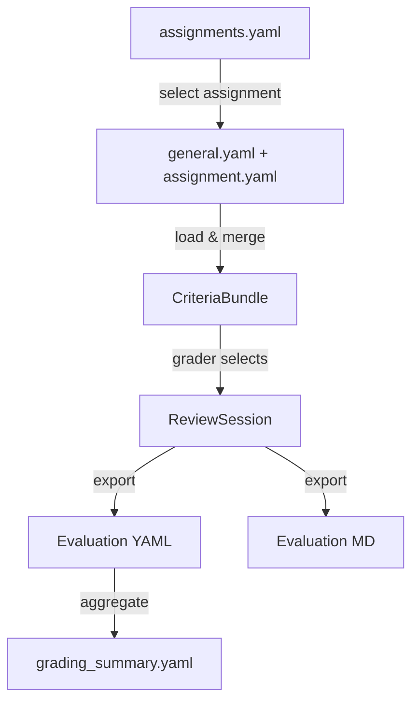

# SciPro Review — Schema Specification

> **Status**: v2 — Clean-slate design based on lessons from the legacy JSON
> web app and the SvelteKit prototype. YAML-first, no JSON criteria files.

## Design Principles

1. **YAML everywhere** — All configuration, criteria, and grading data lives in
   `.yaml` files. No more split between JSON criteria and YAML config.
2. **One assignment = one criteria file** — Each assignment gets a single YAML
   file that bundles all its assignment-specific categories. General criteria
   remain in a shared `general.yaml`.
3. **Explicit over implicit** — Sub-points are always objects with `text`, not
   bare strings. Flags like `comment` and `point_deduction` are explicit booleans,
   not inferred from trailing colons.
4. **Consistent key naming** — `snake_case` everywhere. No more `camelCase`
   JSON keys vs `snake_case` YAML keys vs `snake_case_with_and` frontmatter keys.
5. **Self-contained assignments** — An assignment entry lists its criteria files
   and grading dimensions in one place. No separate `references.json`.
6. **Structured export** — The review export format is a nested YAML/JSON object,
   not a flat key-value map with fragile scoped keys.

## Data Flow



## File Layout

```
data/
├── assignments.yaml          # Registry of all assignments
├── grading_config.yaml       # Grading dimensions, weights, grade boundaries
├── criteria/
│   ├── general.yaml          # Shared rubric (6 categories)
│   ├── atom_interaction.yaml # Atom Interaction assignment-specific (5 categories)
│   ├── pandas.yaml           # Pandas assignment-specific
│   └── ...                   # One file per assignment type
└── grade_boundaries.yaml     # Percentage → German grade mapping
```

## Schema Documents

| Document | Purpose |
|----------|---------|
| [assignments-schema.md](assignments-schema.md) | Assignment registry — id, title, criteria files, enabled |
| [criteria-schema.md](criteria-schema.md) | Rubric criteria — categories, main points, sub-points |
| [grading-config-schema.md](grading-config-schema.md) | Grading dimensions, weights, grade boundaries |
| [evaluation-output-schema.md](evaluation-output-schema.md) | Review session output — structured YAML/JSON export |
| [evaluation-md-schema.md](evaluation-md-schema.md) | Human-readable evaluation Markdown format |
| [typescript-schema.md](typescript-schema.md) | TypeScript type definitions for the full data model |
| [design-decisions.md](design-decisions.md) | Lessons learned and rationale for schema choices |

## Quick Reference

### Category Keys

| Key | Title | Scope |
|-----|-------|-------|
| `code_formatting` | Code Formatting | general |
| `coding_concept` | Coding Concept | general |
| `jupyter_notebooks` | Jupyter Notebooks | general |
| `academic_scholarship` | Academic Scholarship | general |
| `following_instructions` | Following Instructions | general |
| `general_feedback` | General Feedback | general |
| `user_defined_functions` | User-Defined Functions | assignment-specific |
| `function_calling` | Function (and Method) Calling | assignment-specific |
| `pandas` | Pandas | assignment-specific |
| `plotting` | Plotting Data | assignment-specific |
| `significant_figures` | Significant Figures | assignment-specific |

### Grading Dimensions

| Key | Title | Max | Weight |
|-----|-------|-----|--------|
| `code_quality_design` | Code Quality & Design | 6.0 | 4 |
| `code_execution_results` | Code Execution & Results | 6.0 | 4 |
| `assignment_requirements` | Assignment Requirements | 6.0 | 4 |
| `scientific_programming` | Scientific Programming | 6.0 | 4 |
| `creativity` | Creativity | 4.0 | 1 |

### Grade Formula

$$\text{percentage} = \frac{\sum_i (\text{score}_i \times \text{weight}_i)}{\sum_i (\text{max}_i \times \text{weight}_i)} \times 100$$