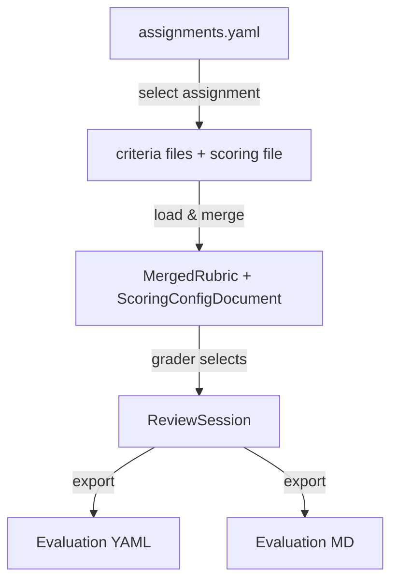

# SciPro Review — Schema Specification

> **Status**: v2 — Clean-slate design based on lessons from the legacy JSON
> web app and the SvelteKit prototype. YAML-first, no JSON criteria files.

## Design Principles

1. **YAML everywhere** — All configuration, criteria, and grading data lives in
   `.yaml` files. No more split between JSON criteria and YAML config.
2. **One assignment = one criteria file** — Each assignment gets a single YAML
   file that bundles all its assignment-specific categories. General criteria
   remain in a shared `general.yaml`.
3. **Explicit over implicit** — Sub-points are always objects with `text`, not
   bare strings. Flags like `comment` and `point_deduction` are explicit booleans,
   not inferred from trailing colons.
4. **Consistent key naming** — `snake_case` everywhere. No more `camelCase`
   JSON keys vs `snake_case` YAML keys vs `snake_case_with_and` frontmatter keys.
5. **Self-contained assignments** — An assignment entry lists its criteria files
   and grading dimensions in one place. No separate `references.json`.
6. **Structured export** — The review export format is a nested YAML/JSON object,
   not a flat key-value map with fragile scoped keys.

## Data Flow



## File Layout

```
data/
├── assignments.yaml           # Registry of all assignments (id, enabled, scoring_file, criteria_files, dimensions)
├── grading_config.yaml        # Grading dimensions, weights, grade boundaries (label + us_equiv)
├── criteria/
│   ├── general.yaml           # Shared rubric (4 categories)
│   ├── following_instructions.yaml  # Shared (per-assignment; soil_contamination)
│   ├── general_feedback.yaml        # Shared (per-assignment; soil_contamination)
│   ├── atom_interaction.yaml  # Atom Interaction assignment-specific (7 categories)
│   ├── soil_contamination.yaml # Soil Contamination assignment-specific (8 categories)
│   ├── molecular_dynamics.yaml
│   ├── quantum_chemistry.yaml
│   └── ...                    # One file per assignment type
└── scoring/                   # Per-assignment scoring semantics
    └── soil_contamination.yaml # (see scoring-config-schema.md)
```

## Schema Documents

| Document | Purpose |
|----------|---------|
| [assignments-schema.md](assignments-schema.md) | Assignment registry — id, title, enabled, scoring_file, criteria_files, dimensions |
| [criteria-schema.md](criteria-schema.md) | Rubric criteria — categories, main points, sub-points |
| [grading-config-schema.md](grading-config-schema.md) | Grading dimensions, weights, grade boundaries |
| [scoring-config-schema.md](scoring-config-schema.md) | Per-assignment scoring semantics — anchors, evidence patterns, disallowed/allowed libraries, Phase 2a dimension guidance |
| [evaluation-output-schema.md](evaluation-output-schema.md) | Review session output — structured YAML/JSON export |
| [evaluation-md-schema.md](evaluation-md-schema.md) | Human-readable evaluation Markdown format |
| [typescript-schema.md](typescript-schema.md) | TypeScript type definitions for the full data model |
| [design-decisions.md](design-decisions.md) | Lessons learned and rationale for schema choices |

> **Copilot harness schemas live with the code.** The pre-evaluation
> copilot's tool/plan surface (`frontend/src/lib/server/copilot/agent.ts`,
> plan phases + `rubric-fidelity.ts` zod schemas) and the recorded thread
> store V2 message shape (`{ format: 2, parts: [{ type: "tool-invocation",
> toolInvocation: { toolName, args, result } }] }` under
> `DATA_DIR/copilot/memory/{threads,messages}/`) are documented at the
> implementation sites, not here. The eval harness
> (`frontend/scripts/run-transcript-evals.mjs --dry-run`) reads that recorded
> store directly.

## Quick Reference

### Category Keys

| Key | Title | Scope |
|-----|-------|-------|
| `code_formatting` | Code Formatting | general (`general.yaml`) |
| `coding_concept` | Coding Concept | general (`general.yaml`) |
| `jupyter_notebooks` | Jupyter Notebooks | general (`general.yaml`) |
| `academic_scholarship` | Academic Scholarship (Citations and Writing) | general (`general.yaml`) |
| `following_instructions` | Following Instructions | shared (`following_instructions.yaml`) |
| `general_feedback` | General Feedback | shared (`general_feedback.yaml`) |
| `user_defined_functions` | User-defined Functions | soil_contamination |
| `function_calling` | Function (and Method) Calling | soil_contamination |
| `pandas` | Pandas | soil_contamination + atom_interaction |
| `numpy` | NumPy | soil_contamination |
| `scipy` | SciPy | soil_contamination |
| `sklearn` | sklearn | soil_contamination |
| `genai` | GenAI | soil_contamination |
| `plotting_visualization` | Plotting / Visualization | soil_contamination |
| `valid_values` / `wrong_numbers` / `atom_interaction` / `user_function` / `calling_function` / `pandas` / `plotting_data` | Atom Interaction categories | atom_interaction (see [criteria-schema.md](criteria-schema.md)) |

### Grading Dimensions

| Key | Title | Max | Weight |
|-----|-------|-----|--------|
| `code_quality_design` | Code Quality & Design | 6.0 | 4 |
| `code_execution_results` | Code Execution & Results | 6.0 | 4 |
| `assignment_requirements` | Assignment Requirements | 6.0 | 4 |
| `scientific_programming` | Scientific Programming | 6.0 | 4 |
| `creativity` | Creativity | 4.0 | 1 |

### Grade Formula

$$\text{percentage} = \frac{\sum_i (\text{score}_i \times \text{weight}_i)}{\sum_i (\text{max}_i \times \text{weight}_i)} \times 100$$