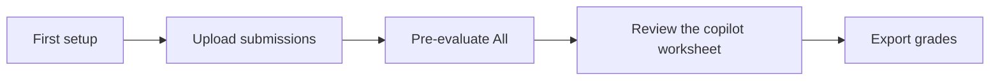

# Teacher Guide — SciPro Review

This guide walks a teacher from first setup to exported grades, one
task at a time. It is the *task-oriented* companion to the in-app
**Documentation** page (`/docs`), which is the full reference. It does not repeat
everything the in-app docs say — it tells you the order to do things, links the
details, and is honest about what the system can and cannot do.

> **The one idea that matters:** the AI copilot is an **accelerator**, not an
> autograder. It drafts a grade worksheet; **you** review it and decide the final
> grade. The pipeline can be *wrong without being broken* — deterministic
> correctness and a fair grade are different questions, and you answer the
> second one.

---

## 1. First setup

Do these in order. Each step maps to one place in the app (or one file).

### First run: the setup wizard

A fresh teacher install lands on the **setup wizard** (`/onboarding`) first —
the teacher build redirects there until the core setup is done, or you dismiss
it once on the finish step. Most steps are completed right inside the wizard:

| Wizard step | What you do | Notes |
|---|---|---|
| **Welcome / fork** | *Start fresh setup* or *Restore a backup from another machine* | Restore brings back settings, assignments and submissions; the remaining steps are then mostly already done |
| **LLM provider** | Enter the API key, pick the model | Saved to the settings store (`data/settings.yaml` + in-process key store) — no `.env` editing |
| **Docs index** *(skippable)* | *Download vectors now* (prebuilt index, ~680 MB, no API key), rebuild locally, or skip | Until an index exists, copilot search degrades to BM25-only — quieter, not broken |
| **Executor check** *(skippable)* | Live probe of the notebook-execution backend | Re-probe or skip and check it later |
| **Reference assignment** *(skippable)* | One click installs the bundled `soil_contamination` assignment, criteria and scoring wired | Already using your own assignment? Skip — your setup counts the same |
| **Finish** | Honest summary of done vs. skipped, then *Finish & open submissions* | Dismissing once stops the redirect; the first grading pass is a non-blocking pointer |

**The redirect, briefly (for teachers who want to skip):** the wizard is the
entrypoint until the LLM provider is configured **and** an assignment is wired
up, in either direction. Docs index, executor check and the first grading pass
**never block** it — skip them freely. To move past the wizard, walk to the
Finish step and press *Finish & open submissions*: the dismissal is recorded
once (`data/wizard_state.json`) and the redirect stops on this machine until
core setup changes again.

The table below is the same ground, mapped to where each thing lives after
the wizard:

| # | Step | Where it happens | Notes |
|---|---|---|---|
| 1 | **Create or import the assignment** | Assignments UI (`/settings/assignments`) → `data/assignments.yaml` | On a fresh install, the wizard's Reference assignment step does this for the bundled `soil_contamination` |
| 2 | **Wire the criteria + scoring** | Assignment editor → `data/criteria/<id>.yaml` + `data/scoring/<id>.yaml` | The rubric checklist + scoring config (anchors, evidence, dimension guidance) |
| 3 | **Configure the LLM provider** | Setup wizard (`/onboarding`) on first run, or Settings → Execution & AI afterwards | Base URL, model id, API key — settings store, not `.env` |
| 4 | **Fetch the offline docs index** *(optional — safe to skip)* | Wizard's **Docs index** step (*Download vectors now*), or from the repo root `frontend/scripts/fetch-docs-index.mjs --public` (plain HTTPS, no gh CLI needed) / `build-docs-index.mjs` to rebuild | Grounds API-fact checks; without it, search is BM25-only (see below). ~680 MB download — defer it until you want grounding |
| 5 | **Upload the first submission** | Submissions page (`/submissions`) upload bar | Drag-and-drop; classified automatically |

### Where each one lives

- **Assignment + criteria + scoring** are *per-assignment* content, edited in the
  **assignment editor**, not on the Settings page. Rubric criteria
  (`data/criteria/<id>.yaml`) define what to check per category; the scoring
  config (`data/scoring/<id>.yaml`) holds anchors, evidence patterns, disallowed
  libraries, and the per-dimension guidance text the model sees.
- **LLM provider** is *app-level*. Configure it in the **Setup wizard** on first
  run or in **Settings → Execution & AI** afterwards: the API key goes to the
  in-process key store (never a settings file), and the base URL / model /
  embedding model to `data/settings.yaml`. `KI_CONNECT_*` env vars still work
  as **Docker/deployment overrides** (the code fallbacks remain), but they are
  no longer part of the setup path. The app works with **any OpenAI-compatible
  endpoint** (KI Connect is the default; OpenRouter is a first-class target) —
  set the base URL, the provider-specific **model id**, and the key.
- **Docs index** — the prebuilt offline index
  (`<DATA_DIR>/docs-index/` — inside the same `data/` tree, gitignored, **not a
  volume**) covers **38,380 chunks across 10 libraries** —
  numpy, pandas, scipy, scikit-learn, matplotlib and seaborn, plus the Python
  stdlib/builtins/typing and curated integration notes (4096-dim vectors).
  Fetching it is **optional**: the prebuilt index is publicly downloadable
  (~680 MB release asset) — a bandwidth consideration, not a secret — and the
  index loader never throws: if the index is missing or the semantic (vector)
  leg is unavailable, retrieval **degrades to BM25-only** (exact-name matching)
  and logs a `loadNote`. That is quieter, not broken. Defer it until you want
  API-fact grounding; nothing in the first run requires it.

> ⚠️ **Localhost-only by design (D4).** The notebook-execution backend
> (**executor**) is **not hardened sandboxing** — it runs untrusted student
> notebooks, and keeping it on localhost (the Docker default) is intentional.
> Do **not** expose it publicly. Treat the whole teacher app as a trusted,
> single-operator tool on your own machine. The full operational model —
> loopback-only binding, no auth, `ORIGIN`/CSRF, executor sandbox limits, the
> residual app-net vector, secret handling — is in
> [concepts.md § 7 "Security & trust boundaries"](concepts.md).

---

## 2. Your first pre-evaluation

1. On the **submissions page** (`/submissions`), upload one or more notebooks
   (drag-and-drop onto the upload bar; files are classified automatically —
   notebooks become submissions, data files become assignment materials).
2. Click **Process** in the toolbar — the executor runs every notebook in its
   own sandbox with the assignment's input data. A failing or timing-out notebook
   does not block the batch; row status updates as each finishes. Watch the
   **progress bar** and the **pipeline log** panel.
3. Click **Pre-evaluate All** — the LLM pre-evaluation runs over the executed
   submissions and produces the draft. It runs inside the app process, so it
   keeps working even if the executor is down.

**What comes out of a pre-evaluation** (per submission):

| Output | What it is | Trust level |
|---|---|---|
| **Cell markers** | Each cell flagged `same` / `different` / `questionable` vs. the reference key | Deterministic — no LLM, reproducible |
| **Dimension scores** | Points on the `0..max_points` scale per grading dimension | LLM — review it |
| **Rubric worksheet** | Turn-based: one rubric category checked per LLM call, edited markdown | LLM — review it |
| **Feedback draft** | Drafted student feedback text | LLM — review it |
| **confidence + flags** | `high_confidence` / `review_optional` / `needs_review` | Deterministic summary of the audit trail — see below |

The **confidence flags** are *not* an AI opinion about the grade. They are a
deterministic summary of the pipeline's own audit trail (retry-loop flags, number
of post-process fixes, execution errors, disallowed imports) that tells you
**which rows to look at first**. The exact thresholds are in the
[Quality statement](quality-statement.md).

---

## 3. Reviewing the copilot worksheet

Reviewing is a **teacher-only**, sequential activity: look at the cells, mark the
rubric, dial the dimension scores, then save and export. The copilot's job is to
make this faster — never to replace your judgment.

1. **Open a submission** — click **Review** in the submissions table to open the
   submission detail page with the notebook execution results.
2. **Reference comparison** — the left panel shows the submission cells
   **side-by-side with the reference key**; markers highlight matches, differences,
   and questionable cells. Student HTML output renders in a sandboxed iframe.
3. **Rubric** — the rubric panel lists the assignment's criteria: check each,
   add comments where allowed, set point deductions.
4. **Grading sidebar** — stays visible while you work: dial each dimension score
   and watch the **live grade calculation** (German 1.0–5.0) update immediately.
5. **Apply or Reject the copilot's suggestions** — the copilot delivers results as
   **suggestions**: apply them with one click or dismiss them. **Nothing is
   written to a submission without an explicit apply** — neither the copilot nor
   anything else bypasses your review.
6. **A human must review before finalizing.** The pre-evaluation is a *draft*.
   You (the teacher) review, accept or fix each evaluation, then it becomes a
   grade. There is no such thing as an unattended final grade.
7. **Check the "Review extras" panel** *(over-tick guard)* — if a submission's
   pre-evaluation looks *too thorough* — many more rubric selections than the
   cohort median — the submission page shows a collapsed **Review extras**
   panel. It flags the rubric categories that exceed the cohort norm and shows
   the cohort median for context. This panel is **advisory only**: it never
   blocks export, and deliberately keeping extra selections is a valid choice.
   Expand it and verify the selection before you accept the evaluation.

**Autofix & dispositions (consequential-error grading)** — when a notebook
breaks mid-run (a root error: a typo, a missing argument, a bad import), the
executor applies a minimal fix so the rest of the notebook still runs. On the
submission detail page you can toggle each cell between the **authentic
original** and the **fixed run**, and for each fixed cell you set a
**disposition**: *accepted* (the fix is correct) or *ignored* (you reject it;
saving always keeps the authentic original). These decisions feed the grade: a
root error counts as a **negative** (it is a student fault), but cells
downstream are judged on the *fixed* output you accepted — so a plot or fit
that never ran because of an earlier typo is **not** additionally penalized.
Cells you *ignored* fall back to the original error. The copilot sees both
runs plus your dispositions, so you can ask it whether a fix looks reasonable;
when a fix differs substantively from what the original code would plausibly
produce, the pipeline flags it for your review.

### The copilot (how to use it)

- Open the **copilot tab** on a submission (per-submission scope) or the
  **copilot button** on the submissions table (whole-assignment scope).
- **Slash commands** — type one in the chat input for a specific capability:
  `/suggest` (grades + rubric), `/draft` (feedback), `/summary` (summarize),
  `/audit` (common issues), `/plagiarism` (check others), `/compare` (vs.
  reference key), `/fix` (broken cells), `/explain`, `/grade`, `/help`. Use
  `/help` to list the available commands.
- **Approval modes**: **Ask** (default — approval-class tools pause for your
  confirmation), **Auto-approve all** (unattended bulk runs; destructive and
  costly bulk tools still ask), **Read-only** (can look and reason but change
  nothing). The **Ask ↔ Auto-approve all** toggle lives in the copilot panel
  header; the persistent mode is `data/settings.yaml` (`copilot.mode`), not
  the Settings page. Per-tool **allow/deny lists** (`allowed_tools` /
  `deny_tools`) refine the mode — deny-listed tools are never callable, and
  destructive tools (`delete-assignment`, `archive-submission`) always require
  your explicit confirmation in every mode.

### Save & export

- **Save** — grading data persists to the server per submission, so you can close
  the page and resume later.
- **Export** — download the graded review as **YAML**: the **student** format
  (`<studentId>.yaml` — v2 evaluation-output, what the student web app
  imports) or the **teacher** format (`<studentId>-teacher.yaml` — full record
  incl. rubric, scores, notes, plagiarism audit).

---

## 4. Calibrating a new assignment (30-second version)

Full detail: [Assignment calibration guide](assignment-calibration.md).

1. Run the pipeline on a **small batch (2–3 submissions)**.
2. **Compare** the dimension scores and rubric selections to your own reference
   grading for those samples (tolerance ≈ ±0.5 per dimension).
3. **Tune the scoring config** — evidence patterns and the per-dimension guide
   text via the scoring editor — and **re-run** until within tolerance.
4. **Repeat** with more submissions until the drift is stable.

The ground truth is **your** grades, not the system's. The scoring config is a
*form*, not a silver bullet — quality comes from the loop. Use the scoring
editor's **Draft with AI** button to get a starting point, but validate its
regexes against real executed output before trusting it.

---

## 5. Exporting grades

| What | How |
|---|---|
| **Single review** | Open the submission → **Export** → student YAML or teacher YAML |
| **Batch** | Submissions page → bulk export of the selected rows — a single YAML when one row, a **ZIP bundle** when many (student or teacher copies) |
| **Save semantics** | Saving persists to the server (per-submission results); exporting downloads a file — they are separate actions |

### Backup & restore

- **Download Backup** zips the entire data directory — submissions, execution
  results, copilot threads, settings, criteria files, and the grading config.
  Take one **before upgrading**.
- **Restore** uploads a backup ZIP to restore all data; existing data is replaced
  by the backup's contents. On a new machine, make sure the app version matches
  the backup's format.

---

## 6. Troubleshooting quick table

For the full troubleshooting list see the in-app **/docs → Troubleshooting**.

| Symptom | Fix |
|---|---|
| **Uploads return 403** | Set `ORIGIN` in `.env` to the URL you actually use to reach the app (e.g. `http://<lan-ip>:4174`) and restart with `docker compose up -d`. This is the CSRF guard, not an upload bug. |
| **No LLM / pre-eval or copilot does nothing** | Check the API key (Settings → Execution & AI — set on first run in the Setup wizard) and the provider's **model id**. Keys are runtime-only, stored in-process, never in a settings file. |
| **Executor not healthy** | `docker compose ps` — the executor must show `healthy`; start with `docker compose up -d` and inspect `docker compose logs executor`. |
| **Pipeline is slow** | Concurrency is capped at **2** against the LLM provider (the empirical rate-limit ceiling — do not raise it). For a faster-but-less-thorough run, set `PRE_EVAL_CRITIQUE=0` to disable the extra critique pass, or pick a faster model in Settings. |

---

## Related docs

| Doc | What it is |
|---|---|
| **In-app `/docs`** | The full how-to reference for setup, configuration, uploads, pipeline, grading, copilot, backup, troubleshooting, deployment |
| [quality-statement.md](quality-statement.md) | What the pre-evaluation gets right, the confidence flags and their thresholds, the honest accuracy posture |
| [assignment-calibration.md](assignment-calibration.md) | How to onboard a new assignment to high-quality pre-evaluation |
| [concepts.md](concepts.md) | The explainable mental model — pipeline, deterministic-vs-LLM, trust boundaries |
| [architecture.md](architecture.md) | The canonical module map and data flow |
| **README** | Quickstart, which build to use, honest limitations, configuration reference |
