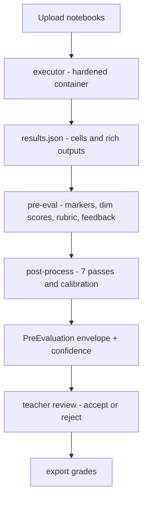
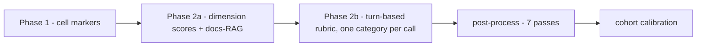

# SciPro Review

> Peer-review and grading tool for Jupyter notebook submissions. Designed for Scientific Programming in Python courses at the Bonn-Rhein-Sieg University of Applied Sciences.

**Student URL:** [emkace.github.io/scipro_review](https://emkace.github.io/scipro_review/)

---

## Overview

SciPro Review serves two modes:

- **Student mode** (SPA, GitHub Pages): Structured peer review of notebook assignments. All data persists in-browser via IndexedDB — no server required.
- **Teacher mode** (Node server, Docker): Grading dashboard, notebook execution, per-submission review pages, rubric-driven grading. Runs locally or in Docker on port 4174.

Both modes share the same SvelteKit codebase. The build adapter (`ADAPTER=static` vs `ADAPTER=node`) determines which features are available.

### Key Features

- **Structured rubric evaluation** — Checklist-based review across multiple categories
- **Real-time grading** — German 1.0–5.0 scale with weighted dimension scores
- **Auto-generated evaluation text** — Markdown export for feedback delivery
- **Import/Export** — YAML, Markdown, and JSON formats with round-trip support
- **Undo/Redo** — Full history management for review sessions
- **Dark mode** — System-aware theme with manual override
- **Mobile responsive** — Usable on tablets and phones
- **Print-friendly** — Evaluation pages optimized for printing
- **Teacher dashboard** (`/submissions/`) — Submissions table with upload bar, search, sort, status filters, and bulk actions
- **Per-submission review** (`/submissions/[id]/`) — Side-by-side cell comparison with reference key, rubric tabs, and grading sidebar

---

## Getting Started

Pick the build you need first (see **Which build do you want?** below), then run one of these two paths:

### Teacher mode (grading dashboard + notebook execution)

Fastest path is Docker — it launches the full teacher release (web app + execution backend) on port `4174`:

```bash
cp .env.example .env       # boot-time settings only — edit ORIGIN if you reach
                           # the app from another machine (the LLM key goes in
                           # the Setup wizard, not here)
docker compose up -d       # open http://localhost:4174
```

The app reads and writes the repo's **tracked `data/` directory directly**
(both containers bind `./data` to `/app/data`) — no volume, no copy step. The
clone boots already configured with the example assignment, and criteria you
author in the app are immediately visible in `git status`. See *Sharing grading
criteria between teachers* below.

Set `ORIGIN` to the address you actually open (e.g. `http://192.168.1.10:4174` when
reaching the app from another machine) — it is required for CSRF-safe file uploads.

**First run (teacher build):** opening `http://localhost:4174` lands you on the
**setup wizard** (`/onboarding`) — the teacher build redirects there until the
core setup is done, or you dismiss it once. The wizard walks you through:

1. **Choose a path** — *start fresh setup*, or *restore from backup* (brings
   back settings, assignments and submissions from another machine; most of the
   remaining setup is then already done).
2. **LLM provider** — enter the API key and pick the model in place. Provider
   config is stored in `data/settings.yaml` plus an in-process key store — no
   `.env` editing.
3. **Docs index** *(optional)* — **Download vectors now** fetches the prebuilt
   public index (~680 MB, no API key), rebuild locally, or skip; until an index
   exists, copilot search degrades to BM25-only.
4. **Executor check** *(optional)* — a live probe that the notebook-execution
   backend is reachable.
5. **Reference assignment** *(optional)* — one click installs the bundled
   `soil_contamination` assignment with criteria and scoring wired.
6. **Finish** — an honest summary of what's done vs. skipped, then *Finish &
   open submissions*. Dismissing once is remembered (`data/wizard_state.json`),
   and the first grading pass is a non-blocking pointer, not a requirement.

From source instead:

```bash
cd frontend
pnpm install
pnpm dev:teacher      # dev server, teacher/node mode at localhost:5173
pnpm build:teacher    # Node build → frontend/build/
pnpm start:teacher    # or run the built server on port 4174
```

First run works the same as the Docker path: the app lands you on the **setup wizard**.

### Student mode (static SPA for GitHub Pages)

```bash
cd frontend
pnpm install
pnpm dev:student      # dev server, student/static mode at localhost:5173
pnpm build:student    # static build → frontend/build/ (deploy to GitHub Pages)
pnpm start:student    # serve the static build on port 4173
```

For the full walkthrough — first start via the setup wizard, deployment env
vars, uploads, pipeline, grading, backup — see the in-app **teacher
documentation** at [`/docs`](frontend/src/routes/docs/+page.svelte) and the
**Documentation** list below.

---

## Which build do you want?

SciPro Review ships **two builds from the same codebase**, selected by the
`ADAPTER` environment variable. They are not interchangeable — decide before you build:

| | **Teacher build** (`ADAPTER=node`) | **Student build** (`ADAPTER=static`) |
|---|---|---|
| What it is | Node server + Python execution backend (`executor/`) | Static SPA — no server |
| Features | Grading dashboard, notebook upload & execution, pre-eval pipeline, AI copilot, per-submission review | Structured peer review, rubric evaluation, export, undo/redo — all in-browser |
| Persistence | Server-side (`DATA_DIR`); runs locally or in Docker on port `4174` | IndexedDB in the browser — data stays on the device |
| Deploy | Local / Docker / your own server | GitHub Pages (see the student URL at the top) |

**Picking:**

- You want to **grade notebook submissions** (upload, execute, pre-evaluate,
  copilot) → **teacher build**. This is the full tool and what the docs assume.
- You only need the **student peer-review experience** on a static host — or you
  are just previewing on GitHub Pages → **student build**.

> ⚠️ Always `rm -rf build` when switching adapters — `frontend/build/` is shared
> between the two of them.

---

## Honest limitations

SciPro Review is real and works for its documented scope — and we keep the
boundaries honest. Before you rely on it:

- **The docs-RAG *semantic* leg is the weak leg.** Retrieval has two paths:
  **BM25** — good at exact API names and identifiers — and a **semantic /
  paraphrase** path (vector search over a **4096-dim** embedding model,
  `e5-mistral-7b-instruct`). The semantic leg needs a **live provider key and a
  matching 4096-dim embedder**, typically the same KI Connect–style endpoint.
  If the embedder is unavailable or the vector space doesn't match, vector
  search **degrades to BM25-only** (the index loader never throws; it logs a
  `loadNote`). That is not a crash — it is a quieter, exact-match search, and
  paraphrase-style queries are the first thing to degrade when the semantic leg
  is down.
- **The executor is localhost-only by design (D4).** The notebook-execution
  backend is **not hardened sandboxing** — binding it to a network interface is
  an **accepted, documented security risk**. Keep it on localhost (the Docker
  default); do not expose it publicly. Treat it as trusted-lan trust only.
- **The grading copilot is a teacher-accelerator, not an autograder.** The
  pre-evaluation emits a draft plus a `gradingConfidence` and explicit flags. A
  human teacher **must** review and Accept/Reject each evaluation before it
  becomes a grade. See the [Quality statement](.github/references/quality-statement.md)
  for what it gets right, what still needs review, and the confidence flags.
- **A provider swap must be validated, not assumed.** The app works with any
  OpenAI-compatible endpoint, but one that 200s on a ping can still return
  out-of-spec embeddings or bail on tool calls silently. Verify LLM calls
  **and** docs-RAG retrieval over real runs before trusting a new provider
  (see the Configuration section and its Validation note).

---

## Documentation

The app ships with an in-app **teacher documentation** page at [`/docs`](frontend/src/routes/docs/+page.svelte), covering:

- **Getting Started** — Docker prerequisites, clone, first start via the Setup wizard
- **Configuration** — Settings page + Setup wizard, deployment env vars, assignments & grading config YAML
- **Uploading Submissions** — file naming, classification, kind override, materials
- **Running the Pipeline** — Process All / Pre-evaluate All, progress & logs, auto-fix
- **Grading Workflow** — reference comparison, rubric, grading sidebar, save & export
- **AI Copilot** — slash commands, approval modes, tool permissions, suggestions
- **Backup & Restore** — full data-directory backup ZIP download/restore
- **Troubleshooting** — 403 uploads, executor health, auth failures, timeouts
- **Deployment** — local, LAN, Tailscale, data persistence, upgrades
- **Security & Trust Boundaries** — loopback-only binding, no auth (never expose without auth + TLS first), ORIGIN/CSRF, executor sandbox limits and the residual app-net risk

> **New to the codebase?** Read the [Concepts & trust boundaries](.github/references/concepts.md) — the explainable mental model (pipeline, deterministic-vs-LLM, what needs a teacher) with visuals, before the deep dive.  
> **Teacher?** Read the [Teacher guide](.github/references/teacher-guide.md) — task-oriented setup, pre-evaluation, review, and export.
> **New assignment?** Read the [Calibration guide](.github/references/assignment-calibration.md) — how to onboard a new assignment to soil-contamination-quality pre-evaluation and copilot support.  
> **How good is the pre-evaluation?** Read the [Quality statement](.github/references/quality-statement.md) — what the copilot gets right, what needs teacher review, and the confidence flags.  
> **One design language?** Read the [Design tokens](.github/references/design-tokens.md) — the token reference and the audit gate for consistent theming.  
> **How is it wired?** Read the [Architecture](.github/references/architecture.md), [Data structures & wiring](.github/references/data-structures.md), and [Developer guide & glossary](.github/references/developer-guide.md) — the canonical, current module map, data flow, and terminology.  
> **Why is it structured this way?** The single-package layout with in-app module extraction is a deliberate choice — a package split was considered and rejected (see the architecture module map and the git history for that decision).

## Configuration

For day-to-day use, **nearly all configuration happens inside the app**: the
**Setup wizard** (`/onboarding`) configures the LLM provider on first run, and
the **Settings page** (`/settings`) covers Execution & AI, Grading, and
Appearance afterwards — both write the same settings store (`data/settings.yaml`
plus an in-process key store; secrets are never written to a settings file).
Per-assignment content is edited in the assignment editor. Only
deployment-level env vars and a few read-only code constants live elsewhere:
standing up the webapp is *not* a six-place exercise.

Everything below is grouped by *purpose*:

| Group | What it covers | Where you change it | When it applies |
| --- | --- | --- | --- |
| **Settings page** | `data/settings.yaml` (Execution & AI), `data/grading_config.yaml` (Grading), appearance (localStorage) | Settings page cards (below) | Saves apply immediately; LLM endpoint/model on the next request |
| **Assignment editor** | Rubric criteria (`data/criteria/<id>.yaml`), scoring config (`data/scoring/<id>.yaml`), assignment metadata (`data/assignments.yaml`) | Assignment editor (Settings → Assignments) | Next request / page load |
| **Deployment environment** | Env vars — `ADAPTER`, `PORT`, `ORIGIN`, `DATA_DIR`, executor, LLM fallbacks, `PRE_EVAL_CRITIQUE` | `.env` / environment (tables below) | Restart required |
| **Read-only constants** | Engineering defaults: concurrency 2, injection threshold 0.7, `TEXTAREA_MIN_CHARS` 20, rich-output caps | Source code (table below) | Rebuild + restart |

Two of the sources below (`data/settings.yaml` and `data/grading_config.yaml`)
are edited from the Settings page — the Setup wizard writes the same store on
first run; the tables here are their reference. **Precedence:** a value set in
the YAML file wins, then the matching environment variable, then the built-in
default. The API key is a runtime secret: it lives in an in-process key store,
entered via the Setup wizard or Settings → Execution & AI, and is never written
to a settings file.

### Deployment configuration (environment variables)

Boot-time concerns only. Set in `.env` / the environment **before** starting
the server; restart to apply. Runtime provider configuration (API key, base
URL, model, embedding model) is **not** here — configure it in the **Setup
wizard** (`/onboarding`) on first run or under **Settings → Execution & AI**
afterwards; it is stored in `data/settings.yaml` + the in-process key store.
[`.env.example`](.env.example) is the canonical template.

**Core deployment variables**

| Variable | Default | Purpose |
| --- | --- | --- |
| `DATA_DIR` | `./data` (Docker: `/app/data`) | Data root for all runtime config and state (settings, assignments, grading config, criteria, submissions, docs index). |
| `DOCS_INDEX_DIR` | `<DATA_DIR>/docs-index` | Docs-RAG index directory holding `docs-index.json` + `docs-vectors.bin`. |
| `ADAPTER` | `node` | Build adapter: `node` (teacher server) or `static` (student SPA). |
| `EXECUTOR_URL` | `http://executor:8766` | Base URL the frontend uses to reach the notebook-execution backend. |

**Deployment & build (rest)**

| Variable | Default | Purpose |
| --- | --- | --- |
| `NODE_ENV` | `production` | Node runtime mode (`production`/`development`). |
| `PORT` | `4174` | Port the teacher Node server listens on. |
| `ORIGIN` | `http://localhost:4174` | Canonical origin teachers use to reach the app. Required for CSRF-safe form POSTs (uploads, materials) over plain HTTP — set it to the address you actually use (e.g. `http://192.168.1.10:4174`). |
| `BODY_SIZE_LIMIT` | `50M` | Max request body (uploads, materials, backups). adapter-node's own default is 512K — too small for notebooks/PDFs; raised to 50M in the Dockerfile and `.env.example`. |
| `COMPOSE_PROJECT_NAME` | `svelte-review` | Docker Compose project name (container/volume prefix). |

**Executor (Python backend)**

| Variable | Default | Purpose |
| --- | --- | --- |
| `EXECUTOR_PORT` | `8766` | Port the FastAPI executor binds. |
| `EXECUTOR_LOG_LEVEL` | `info` | Executor log verbosity (`debug`/`info`/`warning`/`error`). |
| `RICH_OUTPUT_MAX_IMAGE_BYTES` | `5242880` (5 MiB) | Cell image outputs larger than this are skipped (not stored) when saving rich results. |
| `RICH_OUTPUT_MAX_HTML_CHARS` | `200000` | Cell HTML outputs longer than this are truncated. |

**LLM provider (optional Docker overrides)**

The primary place for provider config is the **Setup wizard** (first run) or
**Settings → Execution & AI** (runtime) — the settings store wins when both
exist. These env vars remain as code fallbacks, so existing `.env`-based
installations keep working unchanged:

| Variable | Default | Purpose |
| --- | --- | --- |
| `KI_CONNECT_BASE_URL` | `https://chat.kiconnect.nrw/api/v1` | OpenAI-compatible API base URL (override for `llm.base_url`). |
| `KI_CONNECT_API_KEY` | — (secret) | Bearer token (override). Stored in-process when set via the wizard/Settings; never written to a settings file or sent back to the browser. |
| `KI_CONNECT_MODEL` | `qwen3-30b-a3b-instruct-2507` | Default model (override for `llm.model`). |
| `KI_CONNECT_EMBEDDING_MODEL` | `e5-mistral-7b-instruct` | Embedding model id (override for `llm.embedding_model`). Must keep the 4096-dimension contract of `docs-vectors.bin`. |
| `KI_CONNECT_TIMEOUT_MS` | `60000` | LLM request timeout (override for `llm.timeout_ms`). |
| `SCREENING_MODEL` | (small default) | Overrides the model used to screen untrusted notebook content before it reaches a prompt. |

**Pipeline toggle**

| Variable | Default | Purpose |
| --- | --- | --- |
| `PRE_EVAL_CRITIQUE` | on (`1`) | Set to `0` to disable the extra pre-evaluation critique pass (cost/quality tradeoff). |

### Switching LLM/embeddings provider (e.g. OpenRouter)

KI Connect (`chat.kiconnect.nrw`) is the **default** provider, but it is only an
OpenAI-compatible endpoint — the app works with **any** provider that speaks
that protocol. External users who cannot reach the NRW gateway can point the app
at their own provider (OpenRouter is a first-class documented target). The
**settings store is the primary path** — set in the Setup wizard on first run or
under Settings → Execution & AI; the matching env vars remain as Docker
overrides:

| What | Where | Notes |
| --- | --- | --- |
| Base URL | Settings → Execution & AI → `data/settings.yaml` `llm.base_url` (primary); `KI_CONNECT_BASE_URL` env override | e.g. `https://openrouter.ai/api/v1` |
| Model | Settings → Execution & AI → `data/settings.yaml` `llm.model` (primary); `KI_CONNECT_MODEL` env override | Provider-specific id — use the **`<model-id>`** from the provider's model list (e.g. OpenRouter's `/models`), not an invented name |
| Timeout | Settings → Execution & AI → `data/settings.yaml` `llm.timeout_ms` (primary); `KI_CONNECT_TIMEOUT_MS` env override | Default `60000` |
| API key | **Setup wizard** (first run) or **Settings → Execution & AI** (runtime) — in-process key store; `KI_CONNECT_API_KEY` env as Docker override | **Never** written to `data/settings.yaml` or committed; replaceable at runtime |

**Precedence:** a value in `data/settings.yaml` wins, then the matching
environment variable, then the built-in default (see `settings.ts` —
`fileString`/`fileNumber` over `envString`/`envNumber` over
`DEFAULT_LLM_*`). The Settings **UI** edits the YAML, so changing it there makes
the swap apply live (next LLM request); env vars apply on restart and are the
canonical path for deploy-time / per-instance config.

**Embeddings caveat (docs-RAG).** The query embedder uses the **AI SDK
provider** (`provider.embeddingModel`, model `e5-mistral-7b-instruct`) — but it
reads its endpoint and key from the **environment only** (`KI_CONNECT_BASE_URL`,
`KI_CONNECT_API_KEY` — see `docs-rag.ts`); it does **not** follow
`data/settings.yaml`'s `llm.base_url`. So an env-var provider swap covers both
LLM and embeddings, while a Settings-page swap covers the LLM only. Your chosen
provider must keep the **4096-dimension** contract of `docs-vectors.bin` — on a
dimension mismatch, vector search **degrades to BM25-only** (the index loader
never throws; the degradation is logged). Prefer an embedding model that returns
the same 4096-d vector space.

> **Validation (D2):** a provider swap is accepted **good**, not just
> *compatible*. After switching, verify end-to-end over real runs — an
> OpenAI-compatible API that 200s on a ping but returns out-of-spec embeddings
> or bails on tool calls silently weakens the copilot. Confirm both the LLM
> calls **and** the docs-RAG retrieval behave correctly (search quality and
> non-degraded dimension) before treating the swap as done.

### `data/settings.yaml` — app-level runtime settings

Edited on **Settings → Execution & AI**. Read fresh on every request, so a save applies immediately
(LLM endpoint/model apply on the next LLM request; the copilot agent may need a restart). All keys
optional; defaults shown.

**`executor`** — execution budgets (each falls back to `EXECUTOR_REQUEST_TIMEOUT_MS`,
`EXECUTOR_NOTEBOOK_TIMEOUT_MS`, `EXECUTOR_CELL_TIMEOUT_S` respectively)

| Key | Default | What it does |
| --- | --- | --- |
| `executor.request_timeout_ms` | `30000` | HTTP timeout for a single notebook execution. |
| `executor.notebook_timeout_ms` | `120000` | Per-notebook budget for a batch run. |
| `executor.cell_timeout_s` | `30` | Per-cell execution timeout sent to the executor. |

**`llm`** — LLM provider

| Key | Default | What it does |
| --- | --- | --- |
| `llm.base_url` | `https://chat.kiconnect.nrw/api/v1` | LLM provider base URL (env override: `KI_CONNECT_BASE_URL`). |
| `llm.model` | `qwen3-30b-a3b-instruct-2507` | Model id (env override: `KI_CONNECT_MODEL`). |
| `llm.timeout_ms` | `60000` | LLM request timeout (env override: `KI_CONNECT_TIMEOUT_MS`). |
| `llm.embedding_model` | `e5-mistral-7b-instruct` | Docs-RAG embedder model id (env override: `KI_CONNECT_EMBEDDING_MODEL`); must keep the 4096-dimension contract of `docs-vectors.bin`. |

**`copilot`** — copilot behavior

| Key | Default | What it does |
| --- | --- | --- |
| `copilot.mode` | `ask` | Approval mode: `ask` / `read-only` / `auto-approve-all`. |
| `copilot.allowed_tools` | `[]` | Tools auto-approvable in `ask` mode (session-capped). |
| `copilot.deny_tools` | `[]` | Tools that are never callable. |
| `copilot.approval_ttl_seconds` | `60` | How long an approval card stays valid. |
| `copilot.session_cap` | `20` | Auto-approvals per session in `ask` mode. |
| `copilot.last_messages` | model-aware | Recall window (`1`–`50`); omitted → resolved from the LLM's context size. |
| `copilot.auto_compact` | `true` | Summarize out-of-window messages (cost guard; `false` disables the extra LLM calls). |

### `data/grading_config.yaml` — global grading config

Edited on **Settings → Grading**. Global grading dimensions (key/title/`max_points`/weight) + grade
boundaries. Validated and written atomically; read fresh on grading-page load.

### Appearance

Color scheme (light/dark/system) and autosave. Stored in browser `localStorage` (per-device, not
synced). Edited on Settings → Appearance.

### Assignment editor

Per-assignment content (the app-vs-assignment rule): rubric criteria (`data/criteria/<id>.yaml`),
scoring config (anchors, evidence regexes, disallowed libs, dimension guidance —
`data/scoring/<id>.yaml`), and assignment metadata (`data/assignments.yaml`). Not on the Settings page.

### Sharing grading criteria between teachers

Criteria live in ONE place: the repo's tracked `data/`. The running app binds
that directory directly — no volume, no copy, no sync step. Both teachers and
students already consume the same files (the student build bakes `data/` at
build time).

| In the repo (`data/`) | On the machine only |
|---|---|
| ✅ `assignments.yaml` — registry | ❌ `submissions/` — student notebooks, never committed |
| ✅ `criteria/*.yaml` — rubric | ❌ `materials/` — keys, PDFs, input data |
| ✅ `scoring/*.yaml` — anchors/evidence | ❌ `copilot/`, `plagiarism/` — runtime trails |
| ✅ `grading_config.yaml`, `settings.yaml` | ❌ `docs-index/` — 680 MB vector index |
| | ❌ `.env` — API keys (never even in the repo) |

**Author & share:** write or edit criteria in the app → it is already a change
in your clone (`git status` shows it) → commit and push with your normal git
tool (GitHub Desktop / VS Code — one click, no terminal):

```bash
git add data && git commit -m "criteria: add <assignment>" && git push
```

**Receive:** `git pull` → the app reads the files per request, so the new
criteria are live on the next page load. Nothing else to do.

Two honest notes:

- `settings.yaml` (provider/model config) and `enabled:` toggles in the
  registry are also tracked — a provider swap or an enable/disable will show
  in `git status`. Review before committing; `git checkout -- data/settings.yaml`
  reverts machine-only churn.
- Runtime directories are gitignored, so `git add data` can never sweep
  submissions or keys into the repo.

**Migrating a pre-2.6 named-volume install** (older compose used a
`svelte-review-data` volume): copy its contents into the clone once, then run
the bind-mounted compose:

```bash
docker run --rm -v svelte-review-data:/src -v "$PWD/data:/dst" alpine sh -c "cp -rn /src/. /dst/"
docker compose up -d --build
```

(`frontend/scripts/criteria-export.mjs` / `criteria-import.mjs` remain for
hand-rolled installs that keep DATA_DIR outside the clone — dry-run by
default, `--apply` to write.)

### Read-only code constants

Engineering defaults a teacher never adjusts. To change one, edit the source (or the env default) and rebuild + restart. These do not appear as rows in the app UI — this table is their home:

| Constant | Value | Where it lives |
| --- | --- | --- |
| KI Connect concurrency ceiling | `2` | `src/routes/api/submissions/pre-evaluate/+server.ts` — empirically safe parallel-call cap (do not raise without measuring against KI Connect rate limits) |
| Prompt-injection threshold | `0.7` | `src/lib/server/copilot/agent.ts` (PromptInjectionDetector) |
| `TEXTAREA_MIN_CHARS` | `20` | `src/lib/server/copilot/post-process.ts` — minimum textarea length before evidence-fill kicks in |
| Rich-output caps | `RICH_OUTPUT_MAX_IMAGE_BYTES` 5 MiB / `RICH_OUTPUT_MAX_HTML_CHARS` 200k | `executor/runner.py` — env-driven defaults (set via env / `.env`; listed with the other executor vars above) |

---

**Rule of thumb:** **app-level** changes (llm/executor/copilot, env, localStorage, in-code) go on the
Settings page; **assignment-level** changes (criteria, scoring, per-assignment metadata) go in the
assignment editor.

### Agent Configuration

Agent-facing conventions live in `AGENTS.md` files, readable by any agent
harness (Claude / Codex, Gemini CLI, Cursor, GitHub Copilot):

- The **cross-harness primary** is the root [`AGENTS.md`](AGENTS.md), with
  scoped files at [`frontend/AGENTS.md`](frontend/AGENTS.md),
  [`executor/AGENTS.md`](executor/AGENTS.md), and
  [`data/AGENTS.md`](data/AGENTS.md). Together they encode the build/verify
  commands, the per-package local-commit discipline, and the key invariants
  (golden-prompt byte-equality, the synthetic grading gate, KI Connect concurrency).
- `.github/` remains the **GitHub-native complement**: `agents/*.agent.md`,
  `instructions/`, `copilot-instructions.md`, and `skills/` are Copilot-specific
  and never override `AGENTS.md`.

**Two skill-set model.** Skills have two distinct homes, and only one lives in
this repo:

- `.hermes/skills/` — the assistant's own skill directory (how *we* work). It is
  **not** in the repository (gitignored); do not create or edit it here.
- Repo skills (dev-environment skills such as `AGENTS.md`/scoped conventions,
  plus webapp skills supplied to the copilot harness) are **tracked in the
  repo** — the first webapp skill lands with a later package.

### Development Container

This repo is monorepo-friendly and language-mixed (Node 22 + pnpm for the
SvelteKit app, Python 3.12 + uv for the executor). For a reproducible **DEV**
environment open the repo in a dev container via [`devcontainer.json`](devcontainer.json)
— it provisions identical editor + tooling on any machine. This is *distinct*
from [`docker-compose.yml`](docker-compose.yml), which launches the stable
teacher-mode production release.

---

## Tech Stack

The teacher app is a Node/SvelteKit server that orchestrates a Python notebook-execution backend and an
AI copilot agent over an OpenAI-compatible LLM API (KI Connect).

**Frontend**

| Technology | Purpose |
| --- | --- |
| SvelteKit 2 | App framework — student SPA (`adapter-static`) + teacher Node server (`adapter-node`) |
| Svelte 5 | UI with runes (`$state`, `$derived`, `$effect`) |
| Tailwind CSS v4 | Utility-first styling (+ `@tailwindcss/typography`, `@tailwindcss/forms`) |
| Hand-rolled UI primitives | Buttons, checkboxes, tooltips built on Tailwind + lucide icons |
| `@lucide/svelte` | Icons |
| IndexedDB (`idb`) | Client-side persistence (student mode) |
| Tiptap, KaTeX, highlight.js | Rich evaluation editor + math/code rendering |
| marked | Evaluation Markdown rendering |

**Backend & execution** (`executor/`)

| Technology | Purpose |
| --- | --- |
| Python 3.12, managed with uv | Notebook-execution backend |
| FastAPI / uvicorn | Executor HTTP service |
| nbformat / nbclient / ipykernel | Jupyter notebook parsing and execution |
| numpy, pandas, scipy, scikit-learn, matplotlib, seaborn, sympy | Course curriculum (scientific Python) |

**AI copilot**

| Technology | Purpose |
| --- | --- |
| `@mastra/core` + `@mastra/memory` | Copilot agent harness — plan/act/approve loop, thread memory |
| `@ai-sdk/openai-compatible` + KI Connect | OpenAI-compatible LLM calls (`ki-connect.ts`, `executor/ki_connect.py`) |
| minisearch | Local docs-index search (BM25 / RAG retrieval) |

**Dev & test**

| Technology | Purpose |
| --- | --- |
| TypeScript 6 | Type-safe source |
| Zod 4 | Validation (imports, config) |
| js-yaml | YAML config loading and export |
| Vitest + `@testing-library/svelte` | Unit / component tests |
| Playwright | End-to-end tests |
| `fflate` | Backup / restore ZIP |
| pnpm | Package manager |

## Development Setup

### Prerequisites

- **Node.js** 22+
- **pnpm** 11+

### Getting Started

```bash
# Clone the repository
git clone https://github.com/EmKaCe/scipro_review.git
cd scipro_review/frontend

# Install dependencies
pnpm install
```

> **Rich notebook outputs (teacher preview).** The review page renders rich
> cell outputs — matplotlib plots (`image/png`) and pandas DataFrame displays
> (`text/html`) — alongside the plain-text output. Student HTML renders inside
> a **sandboxed iframe** (`sandbox=""`, no scripts / no same-origin), so it can
> never execute or reach the app. Two executor env vars cap storage:
> `RICH_OUTPUT_MAX_IMAGE_BYTES` (default 5242880 = 5 MiB; larger plots are
> skipped) and `RICH_OUTPUT_MAX_HTML_CHARS` (default 200000; longer HTML is
> truncated). Rich output is **never** included in LLM prompts — they stay
> text-only.

### Student Mode (SPA / GitHub Pages)

```bash
pnpm dev:student          # Dev server at localhost:5173
pnpm build:student        # Static build → frontend/build/
pnpm start:student        # Serve static build on port 4173
```

### Teacher Mode (Node server / Docker)

```bash
pnpm dev:teacher          # Dev server at localhost:5173 (ADAPTER=node)
pnpm build:teacher        # Node build → frontend/build/
pnpm start:teacher        # Start server on port 4174
```

> **Uploads return `403 Cross-site POST form submissions are forbidden`?**
> That is adapter-node's CSRF guard, not an upload bug. It compares the
> browser's `Origin` header against the server's configured origin (`ORIGIN`).
> Docker Compose defaults it to `http://localhost:4174`, which is correct only
> when you open the app **on the same machine via `localhost`**. If you use
> `http://127.0.0.1:4174`, reach the app from another computer
> (`http://<lan-ip>:4174`), or sit behind a proxy/HTTPS, set `ORIGIN` to the
> address you actually use, e.g. `ORIGIN=http://192.168.1.10:4174 docker compose up -d`.
> GETs and the health check keep working without it — only multipart uploads
> fail — which is why the failure looks like a feature bug.

> **LLM calls fail with `The model '…' does not exist`?**
> The configured model id does not match the provider's registry. KI Connect
> uses **mixed vendor prefixes** — `openai-gpt-oss-120b` (prefixed) but
> `qwen3-30b-a3b-instruct-2507` (unprefixed) — so the id must be spelled
> exactly as listed. List the valid ids with
> `GET $KI_CONNECT_BASE_URL/models` (or pick from the Settings page's model
> picker), change the model under **Settings → Execution & AI** (that is also
> where the Setup wizard writes it; `KI_CONNECT_MODEL` in `.env` is only a
> Docker override), and **restart** — settings are cached at load, not
> hot-reloaded.
> The server logs a loud `[ki-connect] Configured model … NOT found` warning
> at the first pipeline/copilot use to surface this early.

### Common Commands

| Command                                 | Description                                                                      |
| --------------------------------------- | -------------------------------------------------------------------------------- |
| `pnpm dev:student`                      | Dev server (student/static mode)                                                 |
| `pnpm dev:teacher`                      | Dev server (teacher/node mode)                                                   |
| `pnpm build:student`                    | Build for GitHub Pages                                                           |
| `pnpm build:teacher`                    | Build for Node/Docker                                                            |
| `pnpm check`                            | Type-check with `svelte-check`                                                   |
| `pnpm lint`                             | Prettier check + ESLint                                                          |
| `pnpm format`                           | Format all files with Prettier                                                   |
| `pnpm test`                             | Run unit tests (Vitest)                                                          |
| `bash scripts/smoke-production-csrf.sh` | Production-build ORIGIN/CSRF gate: upload must 403 without `ORIGIN`, 200 with it |

---

## Project Structure

The repository holds two apps plus runtime configuration and tracked docs:

```
frontend/              SvelteKit app (student SPA + teacher Node server)
executor/              Python notebook-execution backend
data/                  Runtime configuration (assignments, grading config,
                       criteria, scoring) — tracked, with runtime-state exceptions
.github/references/    Tracked documentation home (architecture, calibration, quality,
                       design tokens, schemas, directives)
scripts/               Root-level helper & smoke-test scripts
```

- `data/` — committed config: `assignments.yaml`, `grading_config.yaml`,
  `criteria/*.yaml`, `scoring/*.yaml`. Runtime state (submissions, plagiarism
  cache, copilot audit log, materials) is gitignored.
- `.github/references/` — the single home for reviewed, versioned docs (linked
  from the Documentation section above): architecture, data structures,
  developer guide, calibration, quality statement, design tokens, schemas, and
  the `directives/` subfolder of non-negotiable pipeline contracts.
- Agent conventions: root + scoped `AGENTS.md` (cross-harness primary) —
  see the *Agent Configuration* note in the Documentation section above.

The frontend source tree in detail (the deep module map lives in
[`.github/references/architecture.md`](.github/references/architecture.md)):

```
frontend/src/
├── lib/
│   ├── components/          # Svelte 5 UI components
│   │   ├── ui/              # In-repo, dependency-free UI primitives (token-only)
│   │   ├── settings/        # Settings page cards (grading, configuration map)
│   │   ├── assignments/     # Assignment editor (criteria / scoring / draft)
│   │   ├── skeleton/        # Loading skeletons
│   │   └── submissions/     # Dashboard, upload panel, review, grading widgets
│   ├── services/            # Rune-based stores + pure service helpers
│   │   ├── submissions-api.ts         # Typed fetch client for every /api/* endpoint
│   │   ├── submissions-store.svelte.ts# Dashboard list/selection/polling store
│   │   ├── plagiarism-store.svelte.ts # Plagiarism result cache (sequence-guarded)
│   │   ├── run-state.svelte.ts        # Shared batch run-state registry (B4)
│   │   ├── autofix-store.svelte.ts    # Autofix dispositions / fixed-view
│   │   ├── submission-filters.ts      # Canonical filter util (shared by page+dashboard)
│   │   ├── grading-config.ts / grade-calculator.ts / criteria-loader.ts
│   │   └── grading-persistence.ts / settings-api.ts / db.ts / validation.ts
│   ├── stores/              # Legacy student-side + app-wide state
│   │   ├── review.svelte.ts # Orchestrator — composes sub-stores (student mode)
│   │   ├── grading/selection/session/rubric/export.svelte.ts
│   │   └── settings/toast/header.svelte.ts
│   ├── server/              # Teacher-server only (SSR + API routes) — see architecture.md
│   │   ├── copilot/         # Pre-evaluation pipeline + copilot harness (pipeline/, tools/)
│   │   ├── plagiarism/      # structural + semantic plagiarism engine
│   │   ├── ki-connect.ts    # OpenAI-compatible endpoint abstraction
│   │   ├── metadata.ts / results-store.ts / executor-client.ts / file-service.ts
│   │   └── criteria.ts / settings.ts / assignments*.ts / grading-*.ts / backup-service.ts
│   ├── types/               # Client-safe wire types (see data-structures.md)
│   └── utils/               # Pure helpers (apply-suggestion, marker-rendering, …)
├── routes/
│   ├── review/[id]/evaluation/   # STUDENT: read-only evaluation view
│   ├── submissions/             # TEACHER: dashboard + per-submission review
│   ├── settings/                # TEACHER: settings + assignment editors
│   ├── docs/                    # TEACHER: in-app documentation
│   └── api/                     # All server endpoints (submissions, pipeline, plagiarism,
│                               #   copilot, config, backup, assignments drafts, …)
└── tests/                       # Vitest mirrors of src/ (copilot, stores, services,
                                #   components, routes)
```

---

## Architecture

The canonical, current reference is
**[`.github/references/architecture.md`](.github/references/architecture.md)**
(component map, data flow, module map) and
**[`.github/references/data-structures.md`](.github/references/data-structures.md)**
(key types, who writes vs reads). The short version:

### High-level data flow (teacher mode)



### Pre-evaluation inside



### Dual-adapter build

The same codebase produces two builds via the `ADAPTER` environment variable:

- `ADAPTER=static` (default): `adapter-static` — pre-rendered SPA for GitHub Pages. Student features only; teacher-only surfaces are hidden in the static build (student mode is the only deployed public build).
- `ADAPTER=node`: `adapter-node` — Node server for Docker/teacher mode. Full teacher routes with SSR, file upload, notebook execution, the pre-eval pipeline, and the copilot harness.

### State management

The app uses **class-based stores** in `.svelte.ts` files with Svelte 5 runes
(`$state` / `$derived` / `$effect`). Student mode has the `ReviewStore`
orchestrator composing focused sub-stores; teacher mode uses
`submissions-store`, `plagiarism-store`, and the shared `run-state` registry
for batch-run progress. See the [developer guide](.github/references/developer-guide.md).

---

## CI/CD

- **CI** (`.github/workflows/ci.yml`): On push/PR runs `pnpm lint` + `pnpm check`, the full vitest suite, and the synthetic grading gate, plus executor pytest (lean by design — no Playwright e2e)
- **Deploy** (`.github/workflows/deploy.yml`): Builds and deploys static build to GitHub Pages on push to `main`
- **Dependabot**: Weekly dependency update PRs (reviewed before merge — no auto-merge)

---

## Contributing

See [`frontend/CONTRIBUTING.md`](frontend/CONTRIBUTING.md) for detailed setup, conventions, and contribution guidelines.

---

## License

This project is licensed under the [GNU Affero General Public License v3.0 (AGPL-3.0)](LICENSE).
