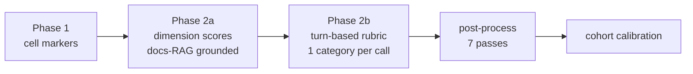

# SciPro Review

> Peer-review and grading tool for Jupyter notebook submissions. Designed for Scientific Programming in Python courses at the Bonn-Rhein-Sieg University of Applied Sciences.

**Student URL:** [emkace.github.io/svelte_review](https://emkace.github.io/svelte_review/)

---

## Overview

SciPro Review serves two modes:

- **Student mode** (SPA, GitHub Pages): Structured peer review of notebook assignments. All data persists in-browser via IndexedDB — no server required.
- **Teacher mode** (Node server, Docker): Grading dashboard, notebook execution, per-submission review pages, rubric-driven grading. Runs locally or in Docker on port 4174.

Both modes share the same SvelteKit codebase. The build adapter (`ADAPTER=static` vs `ADAPTER=node`) determines which features are available.

### Key Features

- **Structured rubric evaluation** — Checklist-based review across multiple categories
- **Real-time grading** — German 1.0–5.0 scale with weighted dimension scores
- **Auto-generated evaluation text** — Markdown export for feedback delivery
- **Import/Export** — YAML, Markdown, and JSON formats with round-trip support
- **Undo/Redo** — Full history management for review sessions
- **Dark mode** — System-aware theme with manual override
- **Mobile responsive** — Usable on tablets and phones
- **Print-friendly** — Evaluation pages optimized for printing
- **Teacher dashboard** (`/submissions/`) — Submissions table with upload bar, search, sort, status filters, and bulk actions
- **Per-submission review** (`/submissions/[id]/`) — Side-by-side cell comparison with reference key, rubric tabs, and grading sidebar

---

## Documentation

The app ships with an in-app **teacher documentation** page at [`/docs`](frontend/src/routes/docs/+page.svelte), covering:

- **Getting Started** — Docker prerequisites, clone, `.env` setup, first start
- **Configuration** — `.env` variables, settings page, assignments & grading config YAML
- **Uploading Submissions** — file naming, classification, kind override, materials
- **Running the Pipeline** — Process All / Pre-evaluate All, progress & logs, auto-fix
- **Grading Workflow** — reference comparison, rubric, grading sidebar, save & export
- **AI Copilot** — slash commands, approval modes, tool permissions, suggestions
- **Backup & Restore** — full data-directory backup ZIP download/restore
- **Troubleshooting** — 403 uploads, executor health, auth failures, timeouts
- **Deployment** — local, LAN, Tailscale, data persistence, upgrades

> **New assignment?** Read the [Calibration guide](.github/references/assignment-calibration.md) — how to onboard a new assignment to soil-contamination-quality pre-evaluation and copilot support.
> **How good is the pre-evaluation?** Read the [Quality statement](.github/references/quality-statement.md) — what the copilot gets right, what needs teacher review, the measured Karl-gate numbers, and the confidence flags.
> **One design language?** Read the [Design tokens](.github/references/design-tokens.md) — the token reference and the audit gate for consistent theming.
> **How is it wired?** Read the [Architecture](.github/references/architecture.md), [Data structures & wiring](.github/references/data-structures.md), and [Developer guide & glossary](.github/references/developer-guide.md) — the canonical, current module map, data flow, and terminology.

## Settings map

Configuration lives across **six surfaces**. The Settings page (`/settings`) indexes them all in a
"Configuration map" card; this is the reference for what goes where.

| Surface | What it holds | Where it's edited |
| --- | --- | --- |
| **Environment variables** | Deployment-level: `DATA_DIR`, `DOCS_INDEX_DIR`, `ORIGIN`, `PRE_EVAL_CRITIQUE`, `KI_CONNECT_BASE_URL`, `KI_CONNECT_API_KEY` (secret) | Environment / `.env` — **restart to apply**. The API key can be set at runtime under Settings → Execution & AI (masked, never read back). |
| **`data/settings.yaml`** | App-level: executor timeouts, LLM provider (base URL / model / timeout), copilot (approval mode, allow/deny tools, TTL, session cap, recall window, auto-compact) | Settings → Execution & AI. Read fresh on every request, so a save applies immediately; LLM endpoint/model changes apply on the next LLM request (copilot agent may need a restart). |
| **`data/grading_config.yaml`** | **Global** grading config: dimensions (key/title/`max_points`/weight) + grade boundaries | Settings → Grading. Validated and written atomically; read fresh by grading pages on load. |
| **Assignment editor** | **Per-assignment** (app-vs-assignment rule): rubric criteria (`data/criteria/<id>.yaml`), scoring config (anchors, evidence regexes, disallowed libs, dimension guidance — `data/scoring/<id>.yaml`), assignment metadata (`data/assignments.yaml`) | Assignment editor → Criteria / Scoring. Not on the Settings page. |
| **localStorage** | Browser-only, per-device: color scheme, autosave (`scipro-settings`) | Settings → Appearance. |
| **Code constants** | Injection threshold 0.7 (`copilot/agent.ts`), KI Connect concurrency 2 (`routes/api/submissions/pre-evaluate/+server.ts`), `TEXTAREA_MIN_CHARS` 20 (`copilot/post-process.ts`), rich-output caps (`RICH_OUTPUT_MAX_IMAGE_BYTES` / `RICH_OUTPUT_MAX_HTML_CHARS`, env-driven in the executor) | Read-only — edit source (or env) + rebuild / restart. |

Application-level changes (llm/executor/copilot, env vars, localStorage, in-code) belong in the
Settings UI; assignment-level changes (per-assignment llm/executor/copilot, criteria, scoring) belong
in the assignment editor. A global llm/executor/copilot setting goes on the normal settings page.

### Agent Configuration

Agent-facing conventions live in `AGENTS.md` files, readable by any agent
harness (Claude / Codex, Gemini CLI, Cursor, GitHub Copilot):

- The **cross-harness primary** is the root [`AGENTS.md`](AGENTS.md), with
  scoped files at [`frontend/AGENTS.md`](frontend/AGENTS.md),
  [`executor/AGENTS.md`](executor/AGENTS.md), and
  [`data/AGENTS.md`](data/AGENTS.md). Together they encode the build/verify
  commands, the per-package local-commit discipline, and the key invariants
  (golden-prompt byte-equality, the Karl gate, KI Connect concurrency).
- `.github/` remains the **GitHub-native complement**: `agents/*.agent.md`,
  `instructions/`, `copilot-instructions.md`, and `skills/` are Copilot-specific
  and never override `AGENTS.md`.

**Two skill-set model.** Skills have two distinct homes, and only one lives in
this repo:

- `.hermes/skills/` — the assistant's own skill directory (how *we* work). It is
  **not** in the repository (gitignored); do not create or edit it here.
- Repo skills (dev-environment skills such as `AGENTS.md`/scoped conventions,
  plus webapp skills supplied to the copilot harness) are **tracked in the
  repo** — the first webapp skill lands with a later package.

### Development Container

This repo is monorepo-friendly and language-mixed (Node 22 + pnpm for the
SvelteKit app, Python 3.12 + uv for the executor). For a reproducible **DEV**
environment open the repo in a dev container via [`devcontainer.json`](devcontainer.json)
— it provisions identical editor + tooling on any machine. This is *distinct*
from [`docker-compose.yml`](docker-compose.yml), which launches the stable
teacher-mode production release.

---

## Tech Stack

| Technology      | Purpose                                            |
| --------------- | -------------------------------------------------- |
| SvelteKit 2     | App framework (SPA + Node server)                  |
| Svelte 5        | UI with runes (`$state`, `$derived`, `$effect`)    |
| Tailwind CSS v4 | Utility-first styling                              |
| Dependency-free UI primitives | Hand-rolled tooltip/button/checkbox components |
| TypeScript 6    | Type-safe source                                   |
| IndexedDB       | Client-side persistence (student mode)             |
| js-yaml         | Criteria loading and export                        |
| Zod 4           | Import validation                                  |
| marked          | Evaluation Markdown rendering                      |
| Vitest          | Unit testing                                       |

---

## Development Setup

### Prerequisites

- **Node.js** 22+
- **pnpm** 11+

### Getting Started

```bash
# Clone the repository
git clone https://github.com/EmKaCe/svelte_review.git
cd svelte_review/frontend

# Install dependencies
pnpm install
```

> **Rich notebook outputs (teacher preview).** The review page renders rich
> cell outputs — matplotlib plots (`image/png`) and pandas DataFrame displays
> (`text/html`) — alongside the plain-text output. Student HTML renders inside
> a **sandboxed iframe** (`sandbox=""`, no scripts / no same-origin), so it can
> never execute or reach the app. Two executor env vars cap storage:
> `RICH_OUTPUT_MAX_IMAGE_BYTES` (default 5242880 = 5 MiB; larger plots are
> skipped) and `RICH_OUTPUT_MAX_HTML_CHARS` (default 200000; longer HTML is
> truncated). Rich output is **never** included in LLM prompts — they stay
> text-only.

### Student Mode (SPA / GitHub Pages)

```bash
pnpm dev:student          # Dev server at localhost:5173
pnpm build:student        # Static build → frontend/build/
pnpm start:student        # Serve static build on port 4173
```

### Teacher Mode (Node server / Docker)

```bash
pnpm dev:teacher          # Dev server at localhost:5173 (ADAPTER=node)
pnpm build:teacher        # Node build → frontend/build/
pnpm start:teacher        # Start server on port 4174
```

> **Uploads return `403 Cross-site POST form submissions are forbidden`?**
> That is adapter-node's CSRF guard, not an upload bug. It compares the
> browser's `Origin` header against the server's configured origin (`ORIGIN`).
> Docker Compose defaults it to `http://localhost:4174`, which is correct only
> when you open the app **on the same machine via `localhost`**. If you use
> `http://127.0.0.1:4174`, reach the app from another computer
> (`http://<lan-ip>:4174`), or sit behind a proxy/HTTPS, set `ORIGIN` to the
> address you actually use, e.g. `ORIGIN=http://192.168.1.10:4174 docker compose up -d`.
> GETs and the health check keep working without it — only multipart uploads
> fail — which is why the failure looks like a feature bug.

### Common Commands

| Command                                 | Description                                                                      |
| --------------------------------------- | -------------------------------------------------------------------------------- |
| `pnpm dev:student`                      | Dev server (student/static mode)                                                 |
| `pnpm dev:teacher`                      | Dev server (teacher/node mode)                                                   |
| `pnpm build:student`                    | Build for GitHub Pages                                                           |
| `pnpm build:teacher`                    | Build for Node/Docker                                                            |
| `pnpm check`                            | Type-check with `svelte-check`                                                   |
| `pnpm lint`                             | Prettier check + ESLint                                                          |
| `pnpm format`                           | Format all files with Prettier                                                   |
| `pnpm test`                             | Run unit tests (Vitest)                                                          |
| `bash scripts/smoke-production-csrf.sh` | Production-build ORIGIN/CSRF gate: upload must 403 without `ORIGIN`, 200 with it |

---

## Project Structure

The repository holds two apps plus runtime configuration and tracked docs:

```
frontend/              SvelteKit app (student SPA + teacher Node server)
executor/              Python notebook-execution backend
data/                  Runtime configuration (assignments, grading config,
                       criteria, scoring) — tracked, with runtime-state exceptions
.github/references/    Tracked documentation home (calibration, quality statement,
                       design tokens, schema specs)
docs/                  Research artifacts & directives (gitignored, except docs/directives/)
scripts/               Root-level helper & smoke-test scripts
```

- `data/` — committed config: `assignments.yaml`, `grading_config.yaml`,
  `criteria/*.yaml`, `scoring/*.yaml`. Runtime state (submissions, plagiarism
  cache, copilot audit log, materials) is gitignored.
- `.github/references/` — the home for reviewed, versioned docs (linked from the
  Documentation section above and from `README`'s references).
- `docs/directives/` — non-negotiable pipeline contracts (e.g. the turn-based
  pre-evaluation directive), tracked as the exception to the gitignored `docs/`.
- Agent conventions: root + scoped `AGENTS.md` (cross-harness primary) —
  see the *Agent Configuration* note in the Documentation section above.

The frontend source tree in detail (the deep module map lives in
[`.github/references/architecture.md`](.github/references/architecture.md)):

```
frontend/src/
├── lib/
│   ├── components/          # Svelte 5 UI components
│   │   ├── ui/              # In-repo, dependency-free UI primitives (token-only)
│   │   ├── settings/        # Settings page cards (grading, configuration map)
│   │   ├── assignments/     # Assignment editor (criteria / scoring / draft)
│   │   ├── skeleton/        # Loading skeletons
│   │   └── submissions/     # Dashboard, upload panel, review, grading widgets
│   ├── services/            # Rune-based stores + pure service helpers
│   │   ├── submissions-api.ts         # Typed fetch client for every /api/* endpoint
│   │   ├── submissions-store.svelte.ts# Dashboard list/selection/polling store
│   │   ├── plagiarism-store.svelte.ts # Plagiarism result cache (sequence-guarded)
│   │   ├── run-state.svelte.ts        # Shared batch run-state registry (B4)
│   │   ├── autofix-store.svelte.ts    # Autofix dispositions / fixed-view
│   │   ├── submission-filters.ts      # Canonical filter util (shared by page+dashboard)
│   │   ├── grading-config.ts / grade-calculator.ts / criteria-loader.ts
│   │   └── grading-persistence.ts / settings-api.ts / db.ts / validation.ts
│   ├── stores/              # Legacy student-side + app-wide state
│   │   ├── review.svelte.ts # Orchestrator — composes sub-stores (student mode)
│   │   ├── grading/selection/session/rubric/export.svelte.ts
│   │   └── settings/toast/header.svelte.ts
│   ├── server/              # Teacher-server only (SSR + API routes) — see architecture.md
│   │   ├── copilot/         # Pre-evaluation pipeline + copilot harness (pipeline/, tools/)
│   │   ├── plagiarism/      # structural + semantic plagiarism engine
│   │   ├── ki-connect.ts    # OpenAI-compatible endpoint abstraction
│   │   ├── metadata.ts / results-store.ts / executor-client.ts / file-service.ts
│   │   └── criteria.ts / settings.ts / assignments*.ts / grading-*.ts / backup-service.ts
│   ├── types/               # Client-safe wire types (see data-structures.md)
│   └── utils/               # Pure helpers (apply-suggestion, marker-rendering, …)
├── routes/
│   ├── review/[id]/evaluation/   # STUDENT: read-only evaluation view
│   ├── submissions/             # TEACHER: dashboard + per-submission review
│   ├── settings/                # TEACHER: settings + assignment editors
│   ├── docs/                    # TEACHER: in-app documentation
│   └── api/                     # All server endpoints (submissions, pipeline, plagiarism,
│                               #   copilot, config, backup, assignments drafts, …)
└── tests/                       # Vitest mirrors of src/ (copilot, stores, services,
                                #   components, routes)
```

---

## Architecture

The canonical, current reference is
**[`.github/references/architecture.md`](.github/references/architecture.md)**
(component map, data flow, module map) and
**[`.github/references/data-structures.md`](.github/references/data-structures.md)**
(key types, who writes vs reads). The short version:

### High-level data flow (teacher mode)

```mermaid
flowchart TD
    A[Upload notebooks] --> B[executor runs them<br/>hardened container]
    B --> C[results.json: cells + rich outputs]
    C --> D[Pre-evaluation pipeline<br/>markers → dim scores → turn-based rubric → feedback]
    D --> E[post-process 7 passes + cohort calibration]
    E --> F[PreEvaluation envelope + gradingConfidence + calibrationAdjustments]
    F --> G[Teacher reviews + Accept/Reject]
    G --> H[saveGrading → export (Karl-compatible)]
```

### Pre-evaluation inside



### Dual-adapter build

The same codebase produces two builds via the `ADAPTER` environment variable:

- `ADAPTER=static` (default): `adapter-static` — pre-rendered SPA for GitHub Pages. Student features only; teacher routes render stubs (student mode is the only deployed public build).
- `ADAPTER=node`: `adapter-node` — Node server for Docker/teacher mode. Full teacher routes with SSR, file upload, notebook execution, the pre-eval pipeline, and the copilot harness.

### State management

The app uses **class-based stores** in `.svelte.ts` files with Svelte 5 runes
(`$state` / `$derived` / `$effect`). Student mode has the `ReviewStore`
orchestrator composing focused sub-stores; teacher mode uses
`submissions-store`, `plagiarism-store`, and the shared `run-state` registry
for batch-run progress. See the [developer guide](.github/references/developer-guide.md).

---

## CI/CD

- **CI** (`.github/workflows/ci.yml`): Runs `pnpm lint` + `pnpm check` on push/PR
- **Deploy** (`.github/workflows/deploy.yml`): Builds and deploys static build to GitHub Pages on push to `main`
- **Dependabot**: Weekly dependency updates with auto-merge for minor/patch

---

## Contributing

See [`frontend/CONTRIBUTING.md`](frontend/CONTRIBUTING.md) for detailed setup, conventions, and contribution guidelines.

---

## License

This project is licensed under the [GNU Affero General Public License v3.0 (AGPL-3.0)](LICENSE).
